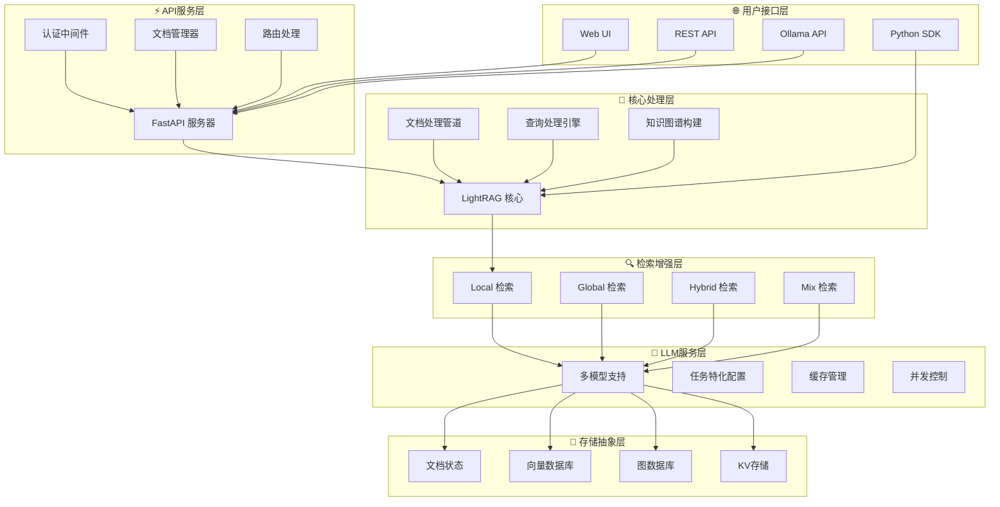
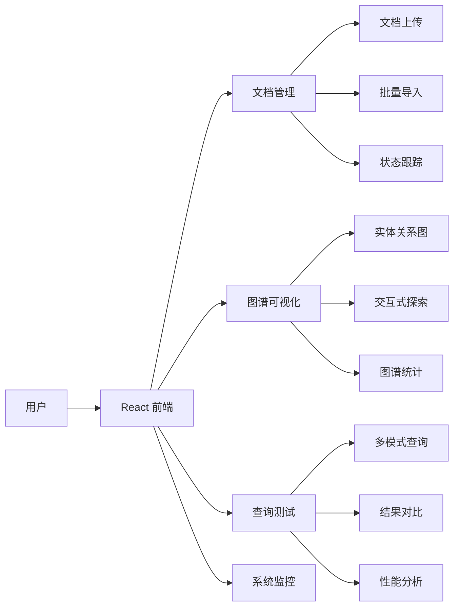
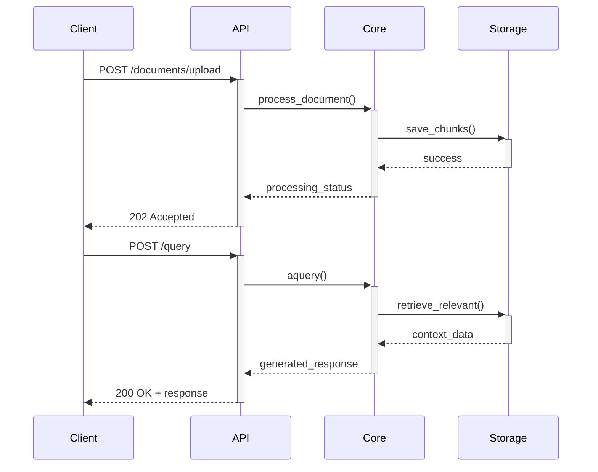
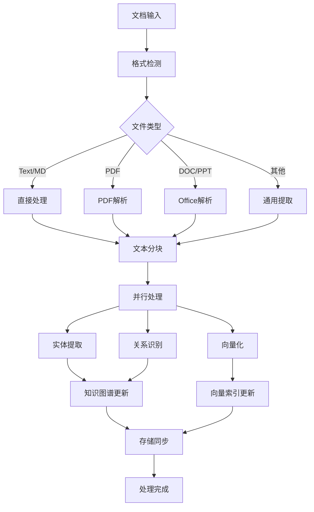
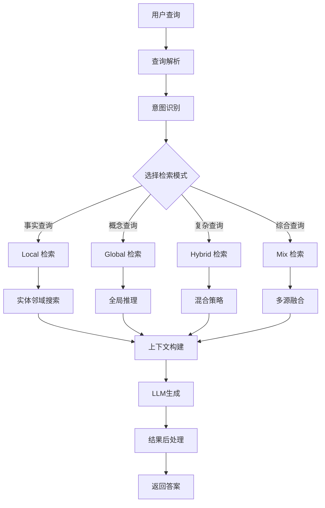
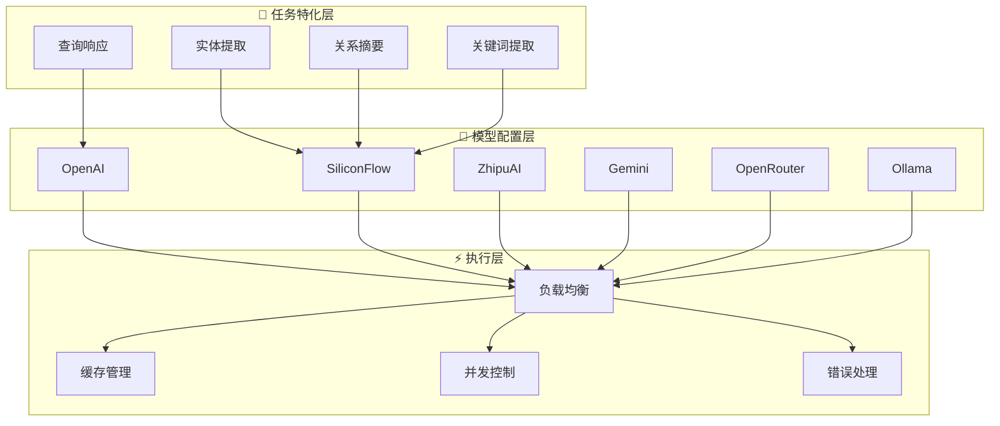
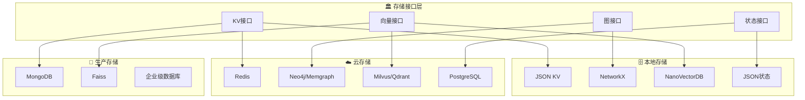
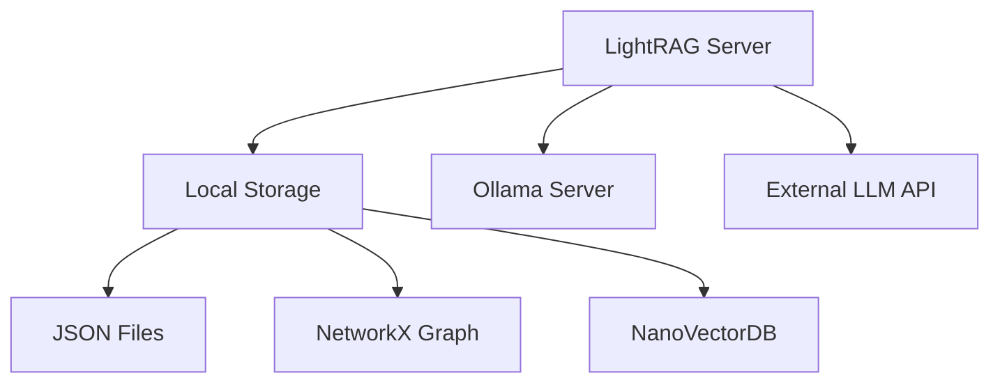
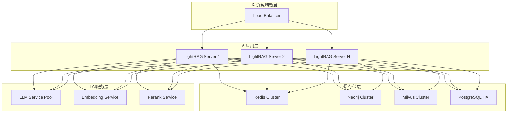

# LightRAG 系统架构指南

## 🏗️ 整体架构概览

LightRAG 采用现代分层架构设计，从用户接口到存储实现共分为6个主要层次，每层职责清晰，接口标准化，支持灵活的组件替换和扩展。

## 📱 用户接口层详解

### 1.1 Web UI 界面

**功能特点**：
- 🎨 **现代化UI**: 基于React的响应式界面
- 📊 **可视化图谱**: 交互式知识图谱探索
- 📈 **实时监控**: 系统状态和性能指标
- 🔍 **查询调试**: 多种查询模式的测试界面

### 1.2 REST API 接口

**API 端点设计**：
- 📄 **文档管理**: `/documents/*` - 上传、删除、状态查询
- 🔍 **查询服务**: `/query/*` - 多模式查询、流式响应
- 🗺️ **图谱操作**: `/graphs/*` - 图谱查询、可视化数据
- 📊 **系统监控**: `/health/*` - 健康检查、性能指标

## ⚙️ 核心处理层架构

### 3.1 文档处理管道

**管道特点**：
- ⚡ **异步处理**: 支持大规模文档的并发处理
- 🔄 **增量更新**: 只处理新增和修改的内容
- 🛡️ **错误恢复**: 自动重试和错误处理机制
- 📊 **进度跟踪**: 实时处理状态和进度反馈

### 3.2 查询处理引擎

## 🤖 LLM服务层

### 5.1 多模型支持架构

**配置策略**：
- 💰 **成本优化**: 不同任务使用不同成本的模型
- 🎯 **性能匹配**: 根据任务复杂度选择合适模型
- 🔄 **动态切换**: 支持运行时模型切换
- 📊 **性能监控**: 实时监控各模型的性能指标

## 💾 存储抽象层

### 6.1 存储架构设计

**存储特点**：
- 🔄 **统一接口**: 所有存储后端实现相同接口
- 📈 **弹性扩展**: 支持从本地到云端的无缝迁移
- 🔒 **数据一致性**: 跨存储的事务一致性保证
- 📊 **性能优化**: 针对不同存储类型的专门优化

## 🔧 部署架构

### 单机部署

### 分布式部署

## 📊 性能特点

- ⚡ **高并发**: 支持数千用户同时查询
- 🚀 **低延迟**: 平均响应时间 < 2秒
- 📈 **高扩展**: 水平扩展支持PB级数据
- 🛡️ **高可用**: 99.9%+ 系统可用性

---

[📚 返回文档目录](./README.md) | [🚀 下一章：核心功能](./03-core-features.md) 