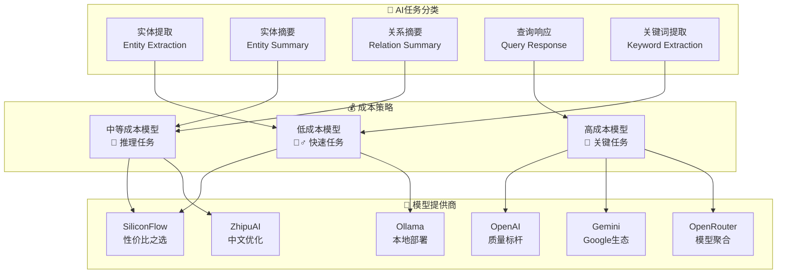
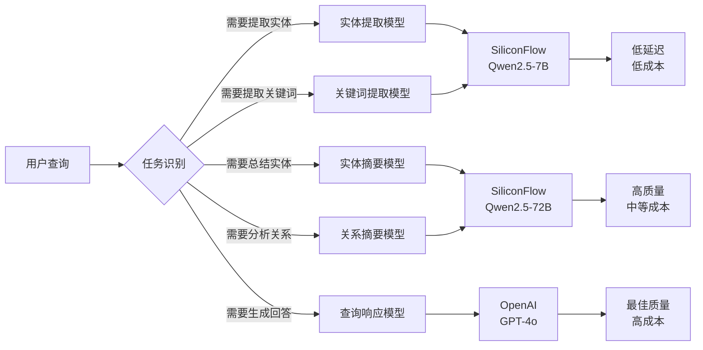
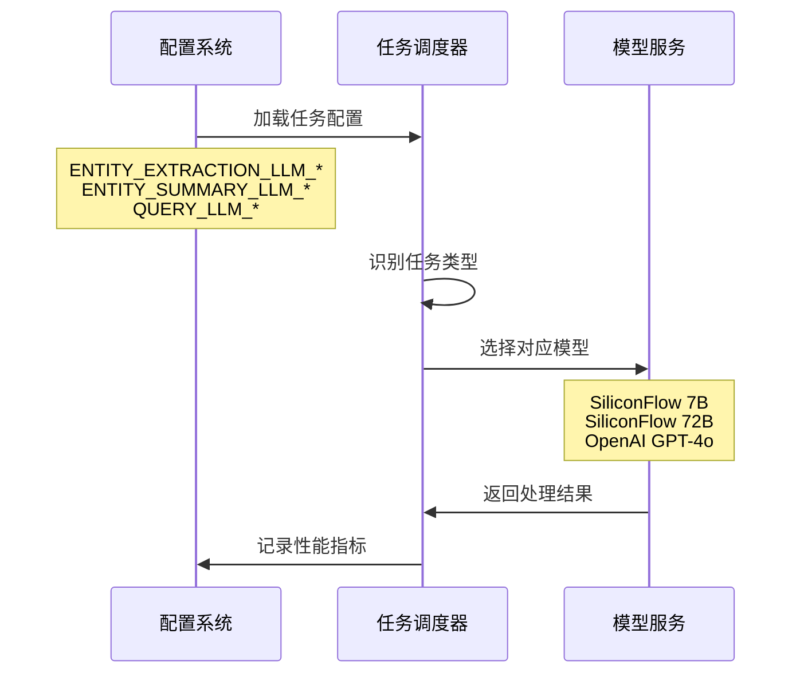
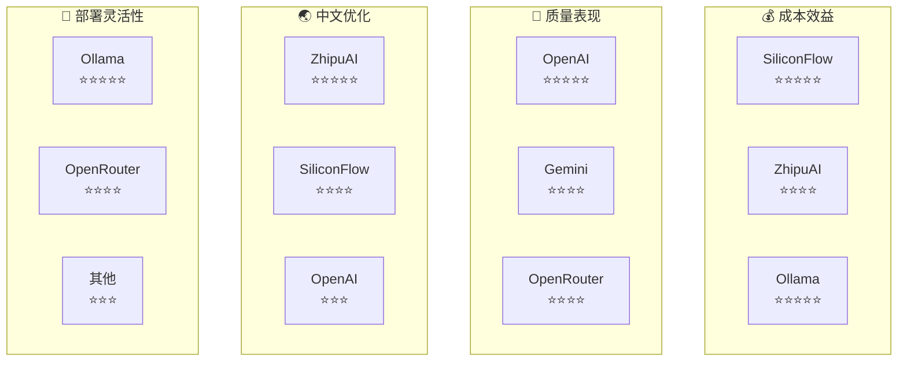
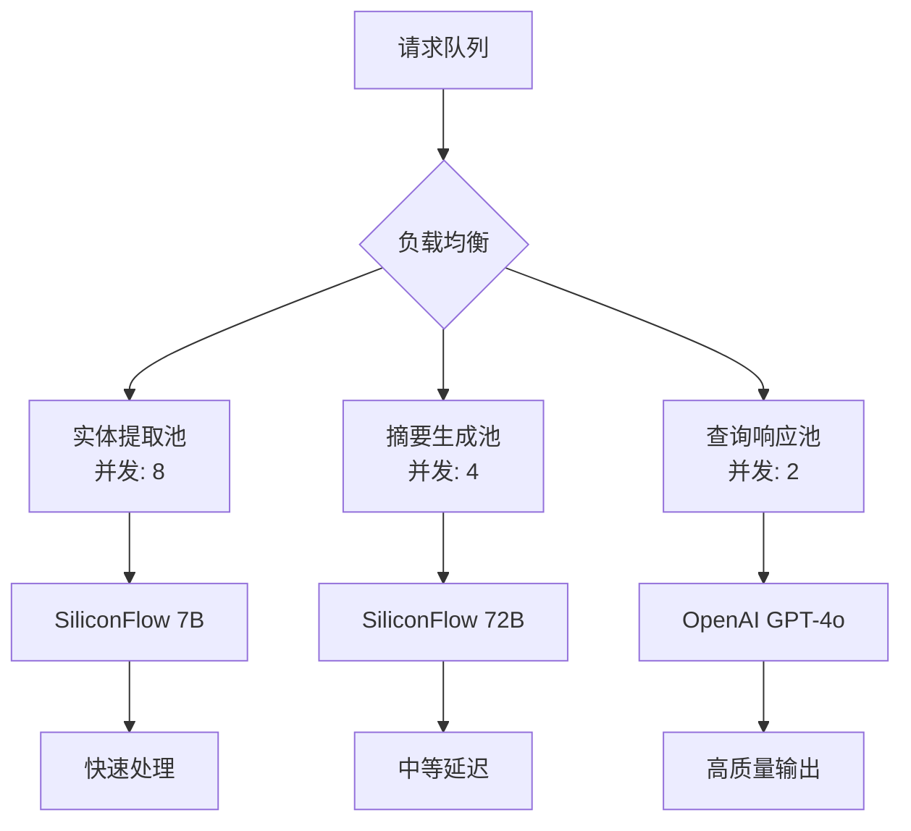
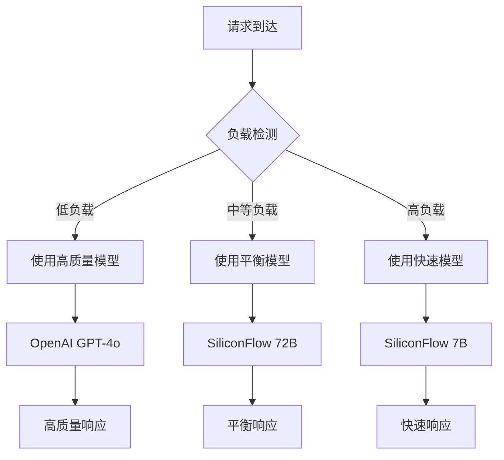
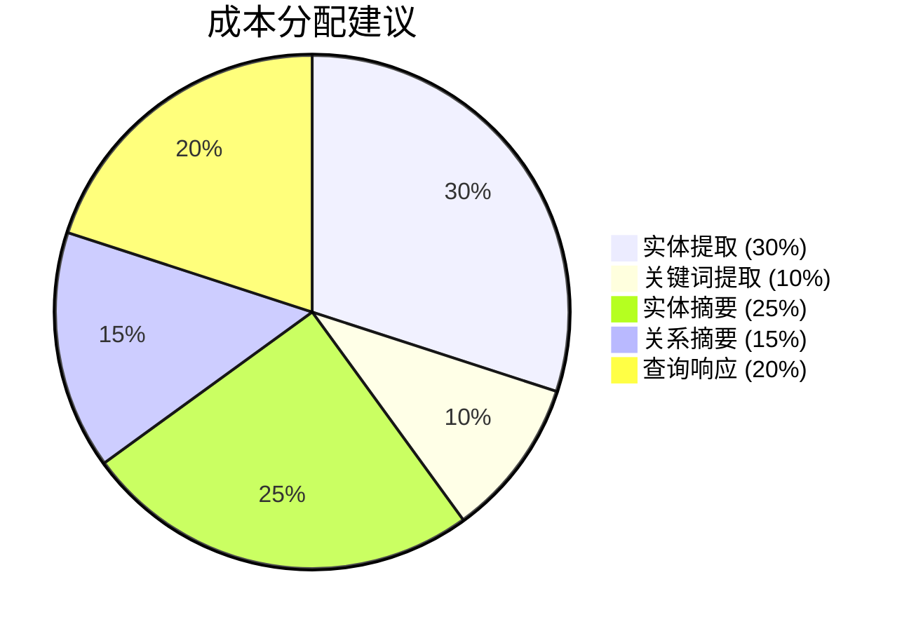

# LightRAG 多模型配置指南

## 🎯 多模型架构概览

LightRAG 支持灵活的多模型配置策略，可以为不同的AI任务配置不同的模型，实现成本与性能的最佳平衡。



## 🔧 配置策略详解

### 1.1 任务特化配置



### 1.2 成本优化策略

| 任务类型 | 复杂度 | 推荐模型 | 成本等级 | 性能要求 |
|---------|--------|----------|----------|----------|
| **实体提取** | 低 | SiliconFlow 7B | 💰 | 速度优先 |
| **关键词提取** | 低 | SiliconFlow 7B | 💰 | 速度优先 |
| **实体摘要** | 中 | SiliconFlow 72B | 💰💰 | 质量平衡 |
| **关系摘要** | 中 | SiliconFlow 72B | 💰💰 | 质量平衡 |
| **查询响应** | 高 | OpenAI GPT-4o | 💰💰💰 | 质量优先 |

## ⚙️ 环境变量配置

### 2.1 全局默认配置

```bash
#################################
### 全局 LLM 配置 (默认配置)
#################################
LLM_BINDING=openai                          # 默认LLM提供商
LLM_MODEL=gpt-4o                           # 默认模型
LLM_BINDING_HOST=https://api.openai.com/v1 # API端点
LLM_BINDING_API_KEY=your_openai_api_key    # API密钥
TEMPERATURE=0.0                            # 生成温度
TIMEOUT=240                                # 超时时间(秒)
MAX_ASYNC=4                                # 最大并发数
```

### 2.2 任务特化配置



#### 实体提取配置 (快速模型)
```bash
# 实体提取 - 使用快速便宜的模型
ENTITY_EXTRACTION_LLM_BINDING=siliconflow
ENTITY_EXTRACTION_LLM_MODEL=Qwen/Qwen2.5-7B-Instruct
ENTITY_EXTRACTION_LLM_BINDING_HOST=https://api.siliconflow.cn/v1
ENTITY_EXTRACTION_LLM_BINDING_API_KEY=your_siliconflow_api_key
```

#### 摘要生成配置 (推理模型)
```bash
# 实体摘要 - 使用推理能力强的模型
ENTITY_SUMMARY_LLM_BINDING=siliconflow
ENTITY_SUMMARY_LLM_MODEL=Qwen/Qwen2.5-72B-Instruct
ENTITY_SUMMARY_LLM_BINDING_HOST=https://api.siliconflow.cn/v1
ENTITY_SUMMARY_LLM_BINDING_API_KEY=your_siliconflow_api_key

# 关系摘要 - 同样使用推理模型
RELATION_SUMMARY_LLM_BINDING=siliconflow
RELATION_SUMMARY_LLM_MODEL=Qwen/Qwen2.5-72B-Instruct
RELATION_SUMMARY_LLM_BINDING_HOST=https://api.siliconflow.cn/v1
RELATION_SUMMARY_LLM_BINDING_API_KEY=your_siliconflow_api_key
```

#### 查询响应配置 (高质量模型)
```bash
# 查询响应 - 使用最高质量模型
QUERY_LLM_BINDING=openai
QUERY_LLM_MODEL=gpt-4o
QUERY_LLM_BINDING_HOST=https://api.openai.com/v1
QUERY_LLM_BINDING_API_KEY=your_openai_api_key
```

#### 关键词提取配置 (快速模型)
```bash
# 关键词提取 - 使用快速模型
KEYWORD_EXTRACTION_LLM_BINDING=siliconflow
KEYWORD_EXTRACTION_LLM_MODEL=Qwen/Qwen2.5-7B-Instruct
KEYWORD_EXTRACTION_LLM_BINDING_HOST=https://api.siliconflow.cn/v1
KEYWORD_EXTRACTION_LLM_BINDING_API_KEY=your_siliconflow_api_key
```

## 🌟 支持的模型提供商

### 3.1 提供商对比



### 3.2 详细配置示例

#### SiliconFlow 配置
```bash
# SiliconFlow - 性价比之选
LLM_BINDING=siliconflow
LLM_MODEL=Qwen/Qwen2.5-72B-Instruct      # 推荐模型
LLM_BINDING_HOST=https://api.siliconflow.cn/v1
LLM_BINDING_API_KEY=your_siliconflow_api_key

# 可选模型
# Qwen/Qwen2.5-7B-Instruct    - 快速模型
# Qwen/Qwen2.5-72B-Instruct   - 高质量模型
# deepseek-ai/DeepSeek-V2.5   - 长上下文
```

#### ZhipuAI 配置
```bash
# ZhipuAI - 中文优化
LLM_BINDING=zhipu
LLM_MODEL=glm-4-plus                       # 推荐模型
LLM_BINDING_HOST=https://open.bigmodel.cn/api/paas/v4
LLM_BINDING_API_KEY=your_zhipu_api_key

# 可选模型
# glm-4-flash      - 快速模型
# glm-4-plus       - 平衡模型
# glm-4-0520       - 高质量模型
```

#### OpenAI 配置
```bash
# OpenAI - 质量标杆
LLM_BINDING=openai
LLM_MODEL=gpt-4o                          # 推荐模型
LLM_BINDING_HOST=https://api.openai.com/v1
LLM_BINDING_API_KEY=your_openai_api_key

# 可选模型
# gpt-4o-mini      - 成本优化
# gpt-4o           - 平衡选择
# o1-preview       - 推理专用
```

#### Ollama 配置
```bash
# Ollama - 本地部署
LLM_BINDING=ollama
LLM_MODEL=qwen2.5:72b                     # 推荐模型
LLM_BINDING_HOST=http://localhost:11434
OLLAMA_NUM_CTX=32768                      # 上下文长度

# 可选模型
# qwen2.5:7b       - 快速模型
# qwen2.5:14b      - 平衡模型  
# qwen2.5:72b      - 高质量模型
# llama3.1:70b     - 英文优化
```

## 📊 性能优化配置

### 4.1 并发控制



```bash
# 并发控制配置
MAX_ASYNC=4                               # 全局最大并发
EMBEDDING_FUNC_MAX_ASYNC=8                # 嵌入函数并发
EMBEDDING_BATCH_NUM=10                    # 嵌入批处理大小

# 不同任务的并发建议
# 实体提取: 高并发 (8-16)
# 摘要生成: 中等并发 (4-8)  
# 查询响应: 低并发 (2-4)
```

### 4.2 缓存策略

```bash
# 缓存配置
ENABLE_LLM_CACHE=true                     # 启用LLM缓存
ENABLE_LLM_CACHE_FOR_EXTRACT=true         # 启用提取缓存

# 缓存策略
# - 实体提取: 长期缓存 (相同文本块)
# - 摘要生成: 中期缓存 (相同实体集)
# - 查询响应: 短期缓存 (相同查询)
```

## 🔧 高级配置

### 5.1 动态模型选择



### 5.2 故障转移配置

```bash
# 主要模型配置
LLM_BINDING=openai
LLM_MODEL=gpt-4o

# 备用模型配置 (当主模型不可用时)
FALLBACK_LLM_BINDING=siliconflow
FALLBACK_LLM_MODEL=Qwen/Qwen2.5-72B-Instruct
FALLBACK_LLM_BINDING_HOST=https://api.siliconflow.cn/v1
FALLBACK_LLM_BINDING_API_KEY=your_siliconflow_api_key

# 故障检测配置
MODEL_HEALTH_CHECK_INTERVAL=300           # 健康检查间隔(秒)
MODEL_RETRY_ATTEMPTS=3                    # 重试次数
MODEL_TIMEOUT=30                          # 单次请求超时
```

## 💡 最佳实践建议

### 6.1 成本优化策略



**推荐配置组合**：
- 🚀 **性能优先**: 全部使用 OpenAI GPT-4o
- ⚖️ **平衡模式**: 提取用 SiliconFlow 7B，摘要用 72B，查询用 GPT-4o
- 💰 **成本优先**: 全部使用 SiliconFlow 或 Ollama

### 6.2 质量监控

```bash
# 质量监控配置
ENABLE_PERFORMANCE_MONITORING=true        # 启用性能监控
LOG_MODEL_PERFORMANCE=true               # 记录模型性能
QUALITY_THRESHOLD=0.8                    # 质量阈值

# 监控指标
# - 响应时间
# - 成功率  
# - 成本统计
# - 质量评分
```

## 📈 配置验证

### 验证配置是否正确

```bash
# 检查配置
python -c "
from lightrag.api.config import global_args
print(f'LLM绑定: {global_args.llm_binding}')
print(f'LLM模型: {global_args.llm_model}')
print(f'API端点: {global_args.llm_binding_host}')
"

# 测试连接
curl -X POST http://localhost:9621/health \
  -H "Content-Type: application/json"
```

### 性能测试

```bash
# 单次查询测试
curl -X POST http://localhost:9621/query \
  -H "Content-Type: application/json" \
  -H "Authorization: Bearer your_api_key" \
  -d '{"query": "测试查询", "mode": "hybrid"}'

# 批量测试
for i in {1..10}; do
  time curl -X POST http://localhost:9621/query \
    -H "Content-Type: application/json" \
    -H "Authorization: Bearer your_api_key" \
    -d '{"query": "测试查询 '$i'", "mode": "local"}'
done
```

---

[📚 返回文档目录](./README.md) | [🚀 下一章：查询模式分析](./09-query-modes-analysis.md) 