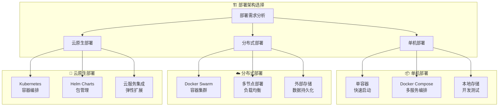
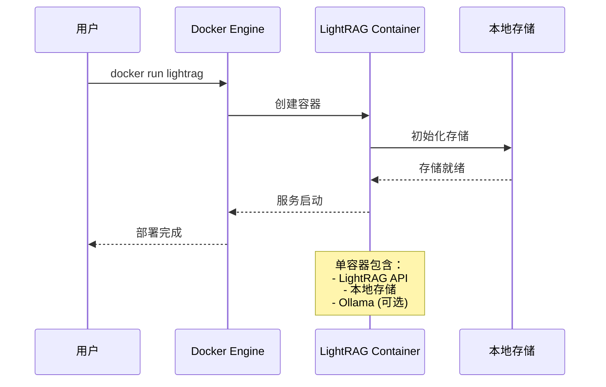
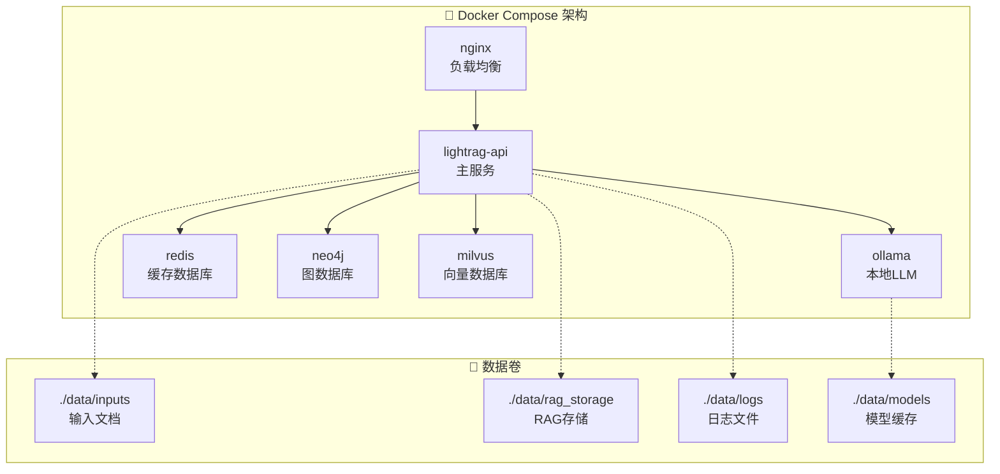
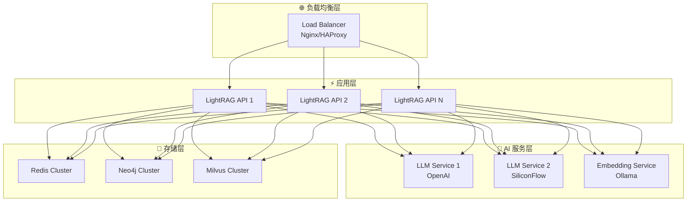

# LightRAG Docker 部署指南

## 🐳 Docker 部署概览

LightRAG 支持多种 Docker 部署方式，从简单的单容器部署到复杂的微服务架构，满足不同规模和需求的应用场景。



## 🎯 部署前准备

### 系统要求

| 组件 | 最低配置 | 推荐配置 | 生产配置 |
|------|----------|----------|----------|
| **CPU** | 2 核 | 4 核 | 8+ 核 |
| **内存** | 4GB | 8GB | 16GB+ |
| **存储** | 20GB | 50GB | 200GB+ |
| **Docker** | 20.10+ | 24.0+ | 最新版 |

### 环境检查

```bash
# 检查 Docker 版本
docker --version
docker-compose --version

# 检查系统资源
docker system info
df -h
free -h
```

## 🚀 快速部署

### 1. 单容器部署



#### 基础部署

```bash
# 使用官方镜像快速启动
docker run -d \
  --name lightrag \
  -p 9621:9621 \
  -v $(pwd)/data:/app/data \
  -e LLM_BINDING=ollama \
  -e LLM_MODEL=qwen2.5:7b \
  hkuds/lightrag:latest
```

#### 完整配置部署

```bash
# 创建数据目录
mkdir -p ./lightrag-data/{inputs,rag_storage,logs}

# 启动完整配置的容器
docker run -d \
  --name lightrag-full \
  -p 9621:9621 \
  -v $(pwd)/lightrag-data:/app/data \
  -v $(pwd)/.env:/app/.env \
  -e LLM_BINDING=openai \
  -e LLM_MODEL=gpt-4o \
  -e LLM_BINDING_API_KEY=your_openai_key \
  -e EMBEDDING_BINDING=ollama \
  -e EMBEDDING_MODEL=bge-m3:latest \
  --restart unless-stopped \
  hkuds/lightrag:latest
```

### 2. Docker Compose 部署



#### 创建 docker-compose.yml

```yaml
version: '3.8'

services:
  # LightRAG 主服务
  lightrag:
    image: hkuds/lightrag:latest
    container_name: lightrag-api
    ports:
      - "9621:9621"
    environment:
      # LLM 配置
      - LLM_BINDING=ollama
      - LLM_MODEL=qwen2.5:7b
      - LLM_BINDING_HOST=http://ollama:11434
      
      # Embedding 配置
      - EMBEDDING_BINDING=ollama
      - EMBEDDING_MODEL=bge-m3:latest
      - EMBEDDING_BINDING_HOST=http://ollama:11434
      
      # 存储配置
      - LIGHTRAG_KV_STORAGE=RedisKVStorage
      - LIGHTRAG_GRAPH_STORAGE=Neo4JStorage
      - LIGHTRAG_VECTOR_STORAGE=MilvusVectorDBStorage
      
      # 数据库连接
      - REDIS_URI=redis://redis:6379
      - NEO4J_URI=bolt://neo4j:7687
      - NEO4J_USERNAME=neo4j
      - NEO4J_PASSWORD=password
      - MILVUS_URI=http://milvus:19530
      
      # 性能配置
      - MAX_ASYNC=8
      - ENABLE_LLM_CACHE=true
    volumes:
      - ./data/inputs:/app/inputs
      - ./data/rag_storage:/app/rag_storage
      - ./data/logs:/app/logs
      - ./.env:/app/.env
    depends_on:
      - redis
      - neo4j
      - milvus
      - ollama
    restart: unless-stopped
    networks:
      - lightrag-network

  # Ollama 本地 LLM 服务
  ollama:
    image: ollama/ollama:latest
    container_name: lightrag-ollama
    ports:
      - "11434:11434"
    volumes:
      - ./data/models:/root/.ollama
    environment:
      - OLLAMA_KEEP_ALIVE=24h
      - OLLAMA_HOST=0.0.0.0
    restart: unless-stopped
    networks:
      - lightrag-network
    deploy:
      resources:
        reservations:
          devices:
            - driver: nvidia
              count: 1
              capabilities: [gpu]

  # Redis 缓存
  redis:
    image: redis:7-alpine
    container_name: lightrag-redis
    ports:
      - "6379:6379"
    volumes:
      - redis-data:/data
    command: redis-server --appendonly yes
    restart: unless-stopped
    networks:
      - lightrag-network

  # Neo4j 图数据库
  neo4j:
    image: neo4j:5.15-community
    container_name: lightrag-neo4j
    ports:
      - "7474:7474"
      - "7687:7687"
    environment:
      - NEO4J_AUTH=neo4j/password
      - NEO4J_PLUGINS=["apoc", "graph-data-science"]
      - NEO4J_apoc_export_file_enabled=true
      - NEO4J_apoc_import_file_enabled=true
    volumes:
      - neo4j-data:/data
      - neo4j-logs:/logs
    restart: unless-stopped
    networks:
      - lightrag-network

  # Milvus 向量数据库
  milvus:
    image: milvusdb/milvus:v2.3.4
    container_name: lightrag-milvus
    ports:
      - "19530:19530"
      - "9091:9091"
    environment:
      - ETCD_ENDPOINTS=etcd:2379
      - MINIO_ADDRESS=minio:9000
    volumes:
      - milvus-data:/var/lib/milvus
    depends_on:
      - etcd
      - minio
    restart: unless-stopped
    networks:
      - lightrag-network

  # Etcd (Milvus 依赖)
  etcd:
    image: quay.io/coreos/etcd:v3.5.5
    container_name: lightrag-etcd
    environment:
      - ETCD_AUTO_COMPACTION_MODE=revision
      - ETCD_AUTO_COMPACTION_RETENTION=1000
      - ETCD_QUOTA_BACKEND_BYTES=4294967296
    volumes:
      - etcd-data:/etcd
    command: etcd -advertise-client-urls=http://127.0.0.1:2379 -listen-client-urls http://0.0.0.0:2379 --data-dir /etcd
    restart: unless-stopped
    networks:
      - lightrag-network

  # MinIO (Milvus 依赖)
  minio:
    image: minio/minio:RELEASE.2023-03-20T20-16-18Z
    container_name: lightrag-minio
    environment:
      - MINIO_ACCESS_KEY=minioadmin
      - MINIO_SECRET_KEY=minioadmin
    volumes:
      - minio-data:/data
    command: minio server /data --console-address ":9001"
    restart: unless-stopped
    networks:
      - lightrag-network

  # Nginx 负载均衡 (可选)
  nginx:
    image: nginx:alpine
    container_name: lightrag-nginx
    ports:
      - "80:80"
      - "443:443"
    volumes:
      - ./nginx.conf:/etc/nginx/nginx.conf
      - ./ssl:/etc/nginx/ssl
    depends_on:
      - lightrag
    restart: unless-stopped
    networks:
      - lightrag-network

volumes:
  redis-data:
  neo4j-data:
  neo4j-logs:
  milvus-data:
  etcd-data:
  minio-data:

networks:
  lightrag-network:
    driver: bridge
```

#### 部署命令

```bash
# 创建必要目录
mkdir -p data/{inputs,rag_storage,logs,models}

# 启动所有服务
docker-compose up -d

# 查看服务状态
docker-compose ps

# 查看日志
docker-compose logs -f lightrag

# 安装 Ollama 模型
docker-compose exec ollama ollama pull qwen2.5:7b
docker-compose exec ollama ollama pull bge-m3:latest
```

## 🏗️ 高级部署配置

### 3. 分布式部署



#### Docker Swarm 部署

```bash
# 初始化 Swarm
docker swarm init

# 创建网络
docker network create --driver overlay lightrag-swarm

# 部署服务栈
docker stack deploy -c docker-swarm.yml lightrag
```

#### docker-swarm.yml 示例

```yaml
version: '3.8'

services:
  lightrag:
    image: hkuds/lightrag:latest
    deploy:
      replicas: 3
      restart_policy:
        condition: on-failure
      placement:
        constraints:
          - node.role == worker
      resources:
        limits:
          cpus: '2'
          memory: 4G
        reservations:
          cpus: '1'
          memory: 2G
    ports:
      - "9621:9621"
    environment:
      - LLM_BINDING=openai
      - REDIS_URI=redis://redis:6379
      - NEO4J_URI=bolt://neo4j:7687
    networks:
      - lightrag-swarm

  redis:
    image: redis:7-alpine
    deploy:
      replicas: 1
      placement:
        constraints:
          - node.role == manager
    volumes:
      - redis-data:/data
    networks:
      - lightrag-swarm

networks:
  lightrag-swarm:
    external: true

volumes:
  redis-data:
```

## 🔧 配置优化

### 性能调优

```bash
# Docker 资源限制
docker run -d \
  --name lightrag \
  --cpus="4" \
  --memory="8g" \
  --memory-swap="16g" \
  -p 9621:9621 \
  hkuds/lightrag:latest
```

### 日志管理

```yaml
services:
  lightrag:
    logging:
      driver: "json-file"
      options:
        max-size: "100m"
        max-file: "3"
    # 或使用 syslog
    logging:
      driver: "syslog"
      options:
        syslog-address: "tcp://localhost:514"
```

### 健康检查

```yaml
services:
  lightrag:
    healthcheck:
      test: ["CMD", "curl", "-f", "http://localhost:9621/health"]
      interval: 30s
      timeout: 10s
      retries: 3
      start_period: 60s
```

## 🛠️ 故障排除

### 常见问题

1. **容器启动失败**
```bash
# 查看详细日志
docker logs lightrag -f

# 检查容器状态
docker inspect lightrag
```

2. **存储权限问题**
```bash
# 修复目录权限
sudo chown -R 1000:1000 ./data
chmod -R 755 ./data
```

3. **网络连接问题**
```bash
# 检查网络连接
docker network ls
docker network inspect lightrag-network
```

4. **资源不足**
```bash
# 检查资源使用
docker stats
docker system df
```

### 监控和维护

```bash
# 服务状态监控
docker-compose ps

# 资源使用监控  
docker stats --format "table {{.Container}}\t{{.CPUPerc}}\t{{.MemUsage}}\t{{.NetIO}}\t{{.BlockIO}}"

# 清理无用资源
docker system prune -a
docker volume prune
```

## 📈 监控和日志

### Prometheus + Grafana

```yaml
services:
  prometheus:
    image: prom/prometheus
    ports:
      - "9090:9090"
    volumes:
      - ./prometheus.yml:/etc/prometheus/prometheus.yml
    networks:
      - lightrag-network

  grafana:
    image: grafana/grafana
    ports:
      - "3000:3000"
    environment:
      - GF_SECURITY_ADMIN_PASSWORD=admin
    networks:
      - lightrag-network
```

---

[📚 返回文档目录](./README.md) | [🚀 下一章：性能调优](./15-performance-tuning.md)
