# LightRAG Documentation

> 🚀 **LightRAG** - 轻量级检索增强生成系统，结合知识图谱与向量检索的高效RAG解决方案

## 📖 文档导航

```mermaid
graph TB
    A[📚 LightRAG 文档中心] --> B[🏗️ 基础文档]
    A --> C[🔧 配置指南] 
    A --> D[📊 技术深入]
    A --> E[🚀 部署运维]
    
    B --> B1[项目概览]
    B --> B2[核心架构]
    B --> B3[特性功能]
    B --> B4[使用示例]
    
    C --> C1[LLM配置]
    C --> C2[多模型部署]
    C --> C3[存储配置]
    C --> C4[API配置]
    
    D --> D1[查询模式分析]
    D --> D2[性能基准测试] 
    D --> D3[算法原理]
    D --> D4[重排序集成]
    
    E --> E1[Docker部署]
    E --> E2[K8s部署]
    E --> E3[性能调优]
    E --> E4[监控运维]
    
    click B1 "./01-project-overview.md"
    click B2 "./02-architecture-guide.md"
    click B3 "./03-core-features.md"
    click B4 "./04-usage-examples.md"
    click C1 "./05-llm-configuration.md"
    click C2 "./06-multi-model-deployment.md"
    click C3 "./07-storage-configuration.md"
    click C4 "./08-api-configuration.md"
    click D1 "./09-query-modes-analysis.md"
    click D2 "./10-performance-benchmarks.md"
    click D3 "./11-algorithm-principles.md"
    click D4 "./12-rerank-integration.md"
    click E1 "./13-docker-deployment.md"
    click E2 "./14-k8s-deployment.md"
    click E3 "./15-performance-tuning.md"
    click E4 "./16-monitoring-operations.md"
```

## 📋 快速开始

| 文档类型 | 推荐阅读 | 适用人群 |
|---------|---------|---------|
| 🏁 **入门** | [项目概览](./01-project-overview.md) → [核心架构](./02-architecture-guide.md) | 新用户、产品经理 |
| 🔧 **开发** | [LLM配置](./05-llm-configuration.md) → [使用示例](./04-usage-examples.md) | 开发者、研究人员 |
| 🚀 **部署** | [Docker部署](./13-docker-deployment.md) → [性能调优](./15-performance-tuning.md) | 运维工程师、架构师 |
| 📊 **研究** | [查询模式分析](./09-query-modes-analysis.md) → [性能基准](./10-performance-benchmarks.md) | 研究人员、技术专家 |

## 🎯 文档特点

### ✨ 可视化图表
- 🎨 **Mermaid 图表**: 架构图、流程图、时序图
- 📊 **性能图表**: 基准测试、对比分析
- 🗺️ **知识图谱**: 概念关系、系统结构

### 📝 专业内容
- 🔬 **深度技术分析**: 算法原理、性能优化
- 💡 **最佳实践**: 配置建议、部署策略
- 🛠️ **实用示例**: 代码样例、配置模板

### 🔄 持续更新
- ✅ **版本同步**: 随代码库同步更新
- 🐛 **问题修复**: 及时修复文档错误
- 💬 **社区反馈**: 接受用户建议改进

## 📞 获取帮助

- 📖 **文档问题**: [GitHub Issues](https://github.com/HKUDS/LightRAG/issues)
- 💬 **社区讨论**: [GitHub Discussions](https://github.com/HKUDS/LightRAG/discussions)
- 🚀 **功能建议**: [Feature Requests](https://github.com/HKUDS/LightRAG/issues/new?template=feature_request.md)

## 📄 许可证

本文档遵循 [Apache 2.0 License](../LICENSE) 开源协议。

---

**⭐ 如果这个项目对您有帮助，请给我们一个 Star！**

[🏠 返回主页](../README.md) · [📚 浏览文档](#-文档导航) · [🚀 快速开始](./01-project-overview.md)

 