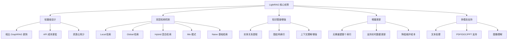
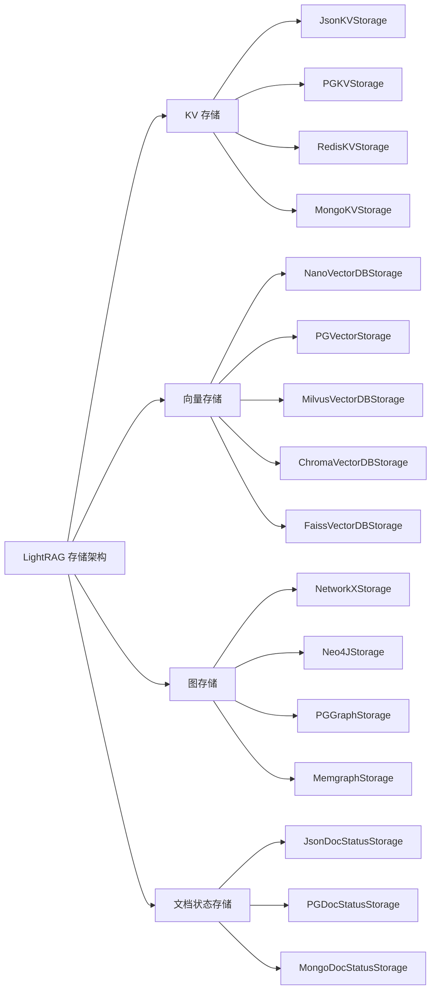
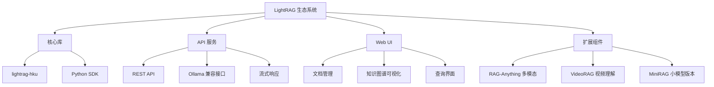

# LightRAG 项目概述

## 项目简介

LightRAG 是由香港大学数据科学实验室开发的轻量级检索增强生成（RAG）系统。它巧妙地结合了知识图谱和向量检索技术，在保持高效性能的同时，显著提升了复杂问答的准确性。

## 核心优势

## 技术特点

### 1. 图增强文本索引
- **实体提取**：自动识别文档中的关键实体
- **关系建模**：构建实体间的语义关系
- **层次化组织**：支持多层次的知识结构

### 2. 双层检索范式
- **低层检索**：精确的实体级别信息检索
- **高层检索**：抽象的概念级别信息整合
- **自适应切换**：根据查询类型自动选择最优检索策略

### 3. 多存储后端支持

## 与其他 RAG 系统对比

| 特性 | LightRAG | GraphRAG | 传统 RAG |
|------|----------|----------|----------|
| **检索方式** | 双层检索 | 社区遍历 | 向量检索 |
| **知识表示** | 知识图谱 + 向量 | 知识图谱 | 向量嵌入 |
| **更新机制** | 增量更新 | 全量重建 | 增量更新 |
| **成本效率** | 高 | 低 | 中 |
| **复杂推理** | 强 | 强 | 弱 |
| **部署难度** | 低 | 高 | 低 |

## 应用场景

### 1. 企业知识管理
- 技术文档问答
- 政策法规查询
- 产品手册检索

### 2. 学术研究
- 文献综述生成
- 跨领域知识整合
- 研究问题探索

### 3. 智能客服
- 复杂问题解答
- 多轮对话支持
- 上下文理解

## 项目生态

## 技术栈要求

### LLM 要求
- **参数规模**：建议 32B 以上
- **上下文长度**：至少 32KB，推荐 64KB
- **支持模型**：OpenAI、Ollama、HuggingFace、Azure OpenAI 等

### 嵌入模型
- **推荐模型**：`BAAI/bge-m3`、`text-embedding-3-large`
- **重要提醒**：嵌入模型需在文档索引前确定，查询时必须使用相同模型

### 重排序模型（可选）
- **推荐模型**：`BAAI/bge-reranker-v2-m3`
- **优化效果**：显著提升检索性能，建议启用 "mix" 模式

## 项目状态

- **开源协议**：MIT License
- **开发状态**：活跃开发中
- **社区支持**：Discord、微信群
- **文档完善度**：高
- **测试覆盖率**：良好

## 下一步学习

1. [架构分析](./02-architecture-analysis.md) - 深入了解系统架构
2. [核心功能](./03-core-features.md) - 掌握主要功能特性
3. [安装部署](./04-installation-deployment.md) - 快速上手部署
4. [使用示例](./05-usage-examples.md) - 实践操作指南
