# LightRAG 架构分析

## 整体架构

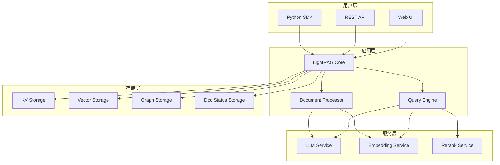

## 核心组件详解

### 1. 文档处理流水线

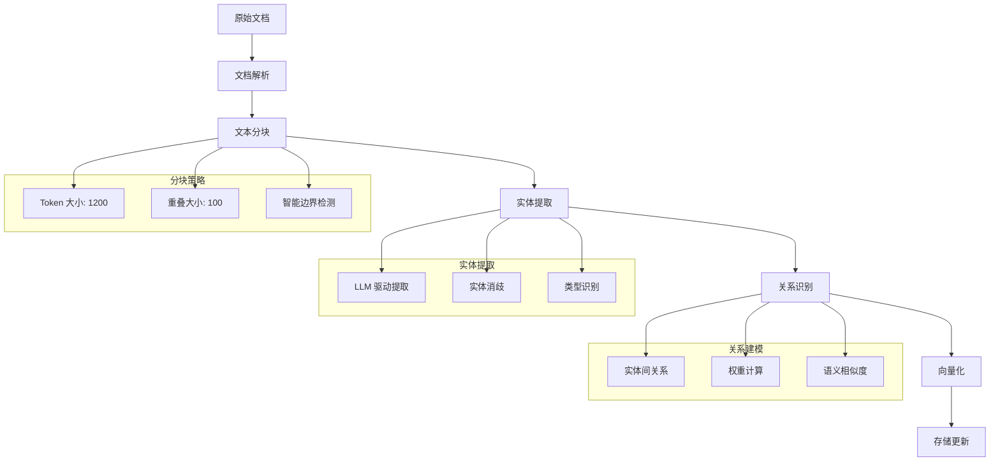

### 2. 双层检索机制

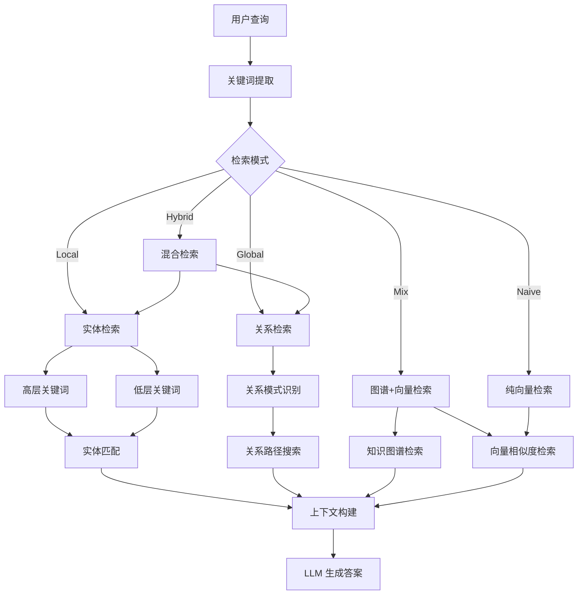

### 3. 存储架构设计

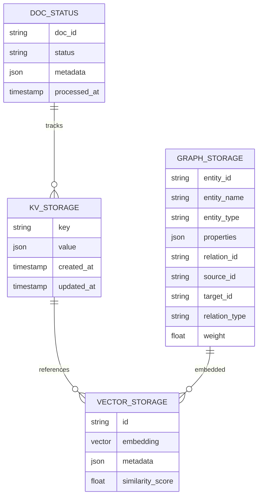

## 关键算法流程

### 1. 实体关系提取算法

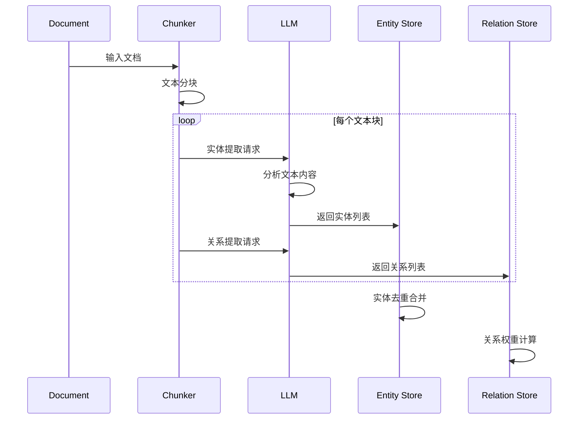

### 2. 查询处理算法

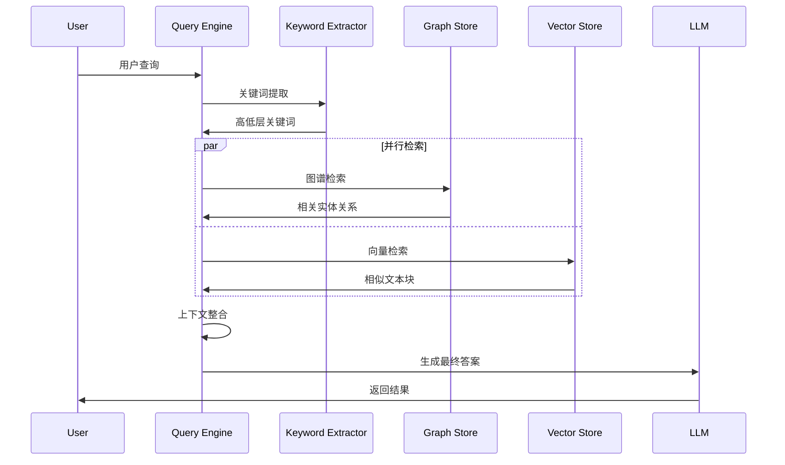

## 性能优化策略

### 1. 缓存机制

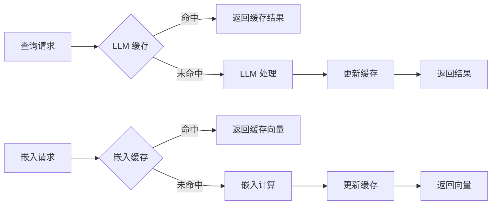

### 2. 并发处理

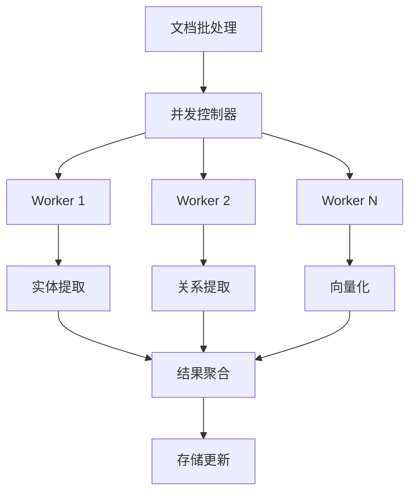

## 扩展性设计

### 1. 插件化架构

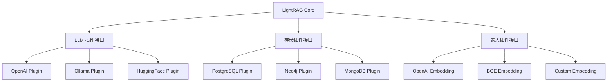

### 2. 水平扩展支持

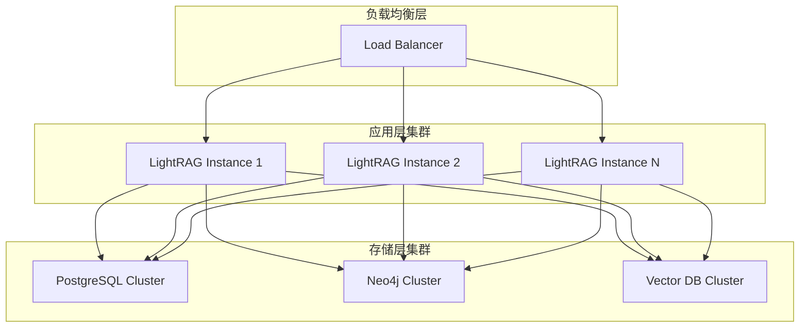

## 配置管理

### 1. 环境变量配置

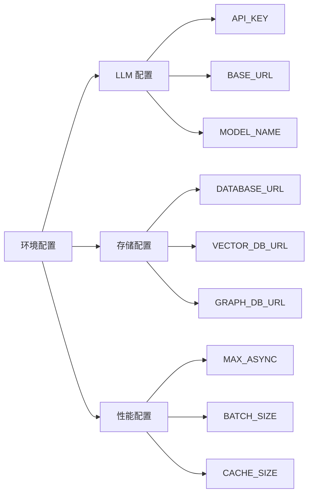

### 2. 运行时配置

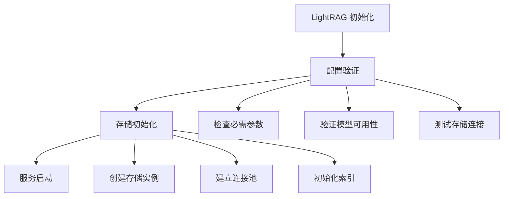

## 监控与调试

### 1. 日志系统

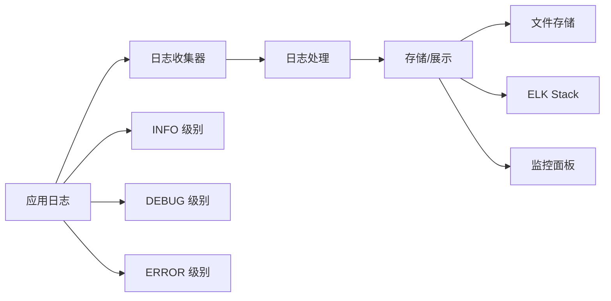

### 2. 性能监控

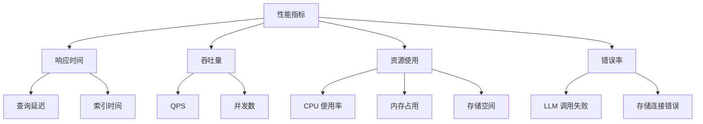

这个架构分析展示了 LightRAG 的核心设计理念和实现细节，为深入理解和使用该系统提供了全面的技术视角。
