# LightRAG 核心功能详解

## 功能概览

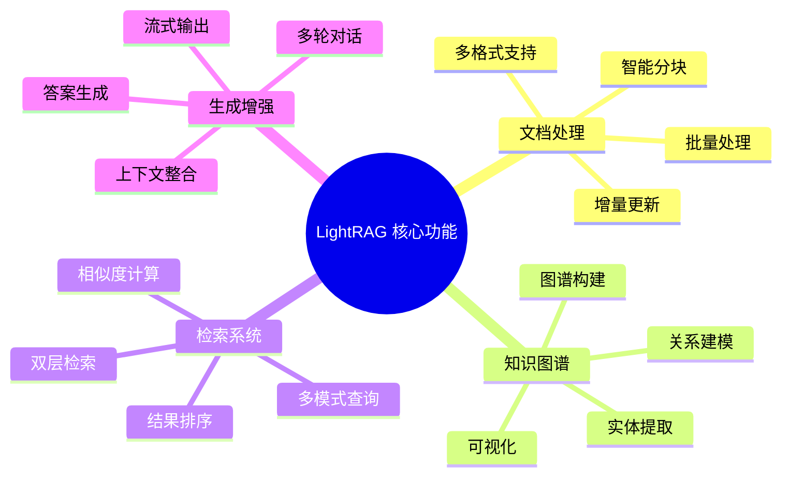

## 1. 文档处理系统

### 1.1 多格式文档支持

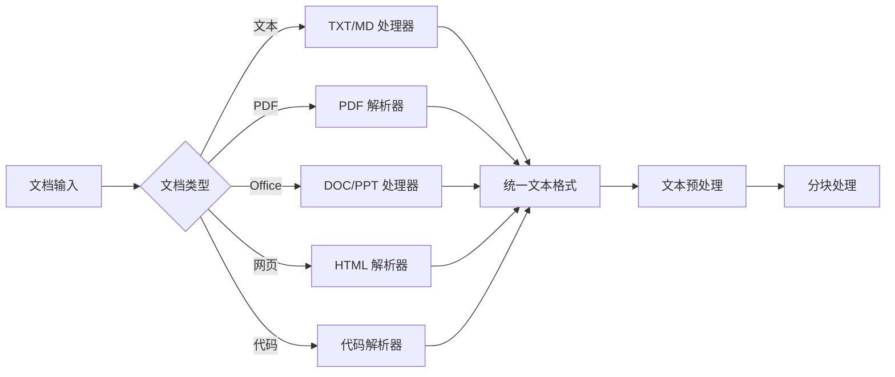

**支持的文档格式：**
- **纯文本**：TXT, MD, CSV
- **PDF 文档**：自动提取文本和表格
- **Office 文档**：DOC, DOCX, PPT, PPTX
- **网页内容**：HTML, XML
- **代码文件**：Python, Java, JavaScript 等

### 1.2 智能文本分块

```python
# 分块配置示例
CHUNK_CONFIG = {
    "chunk_token_size": 1200,      # 每块最大 token 数
    "chunk_overlap_token_size": 100, # 重叠 token 数
    "tiktoken_model_name": "gpt-4o", # 分词模型
    "enable_smart_boundary": True,   # 智能边界检测
    "preserve_structure": True       # 保持文档结构
}
```

**分块策略特点：**
- **智能边界**：避免在句子中间分割
- **结构保持**：保留段落、章节等结构信息
- **重叠处理**：确保上下文连续性
- **动态调整**：根据内容类型调整分块大小

### 1.3 增量更新机制

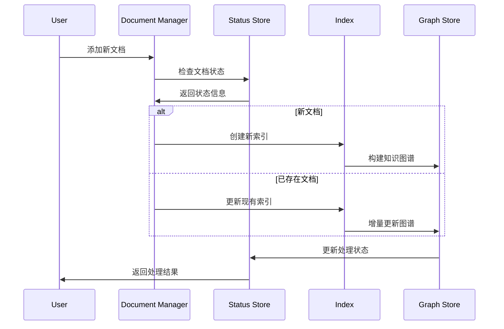

## 2. 知识图谱构建

### 2.1 实体提取流程

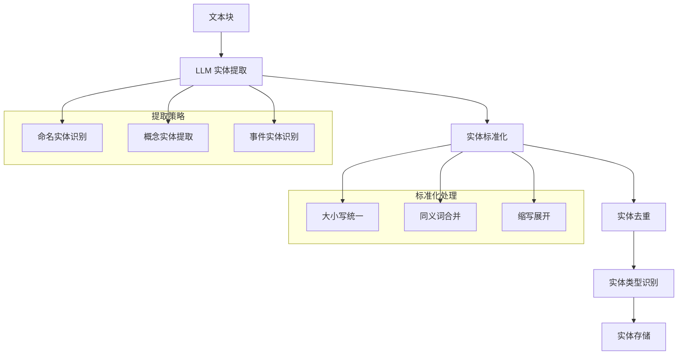

**实体提取示例：**
```python
# 实体提取配置
ENTITY_EXTRACT_CONFIG = {
    "entity_extract_max_gleaning": 1,  # 最大提取轮数
    "entity_summary_to_max_tokens": 500, # 实体摘要最大长度
    "entity_types": [
        "PERSON", "ORGANIZATION", "LOCATION", 
        "CONCEPT", "EVENT", "TECHNOLOGY"
    ]
}
```

### 2.2 关系建模

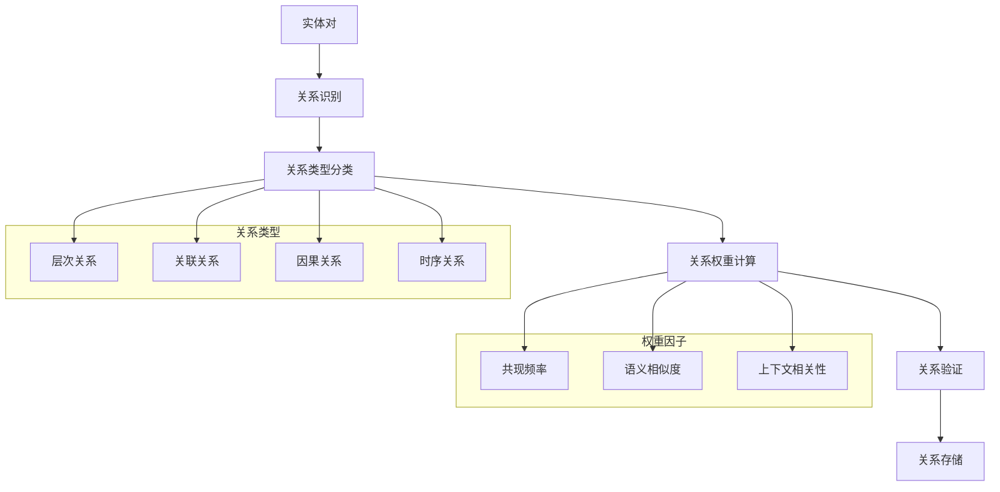

### 2.3 图谱构建算法

```python
# 图谱构建流程
def build_knowledge_graph(documents):
    """构建知识图谱"""
    entities = []
    relations = []
    
    for doc in documents:
        # 1. 实体提取
        doc_entities = extract_entities(doc)
        entities.extend(doc_entities)
        
        # 2. 关系提取
        doc_relations = extract_relations(doc, doc_entities)
        relations.extend(doc_relations)
    
    # 3. 实体去重和合并
    merged_entities = merge_entities(entities)
    
    # 4. 关系权重计算
    weighted_relations = calculate_weights(relations)
    
    # 5. 图谱构建
    graph = construct_graph(merged_entities, weighted_relations)
    
    return graph
```

## 3. 双层检索系统

### 3.1 检索模式对比

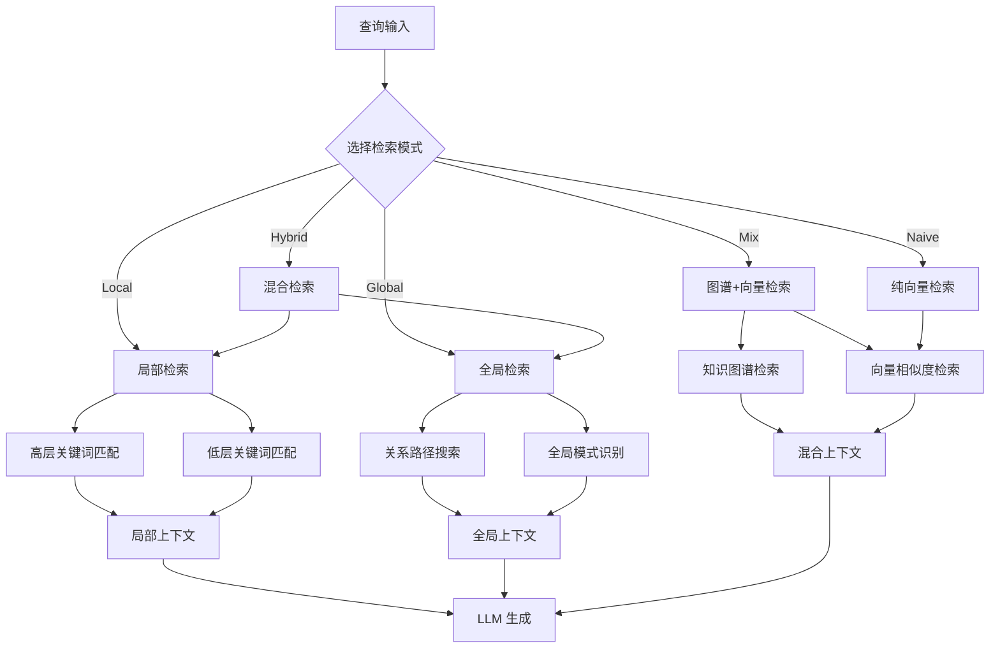

### 3.2 关键词提取策略

```python
# 关键词提取配置
KEYWORD_EXTRACT_CONFIG = {
    "high_level_keywords": {
        "max_count": 8,
        "min_frequency": 2,
        "semantic_threshold": 0.7
    },
    "low_level_keywords": {
        "max_count": 16,
        "include_entities": True,
        "include_concepts": True
    }
}
```

### 3.3 检索性能优化

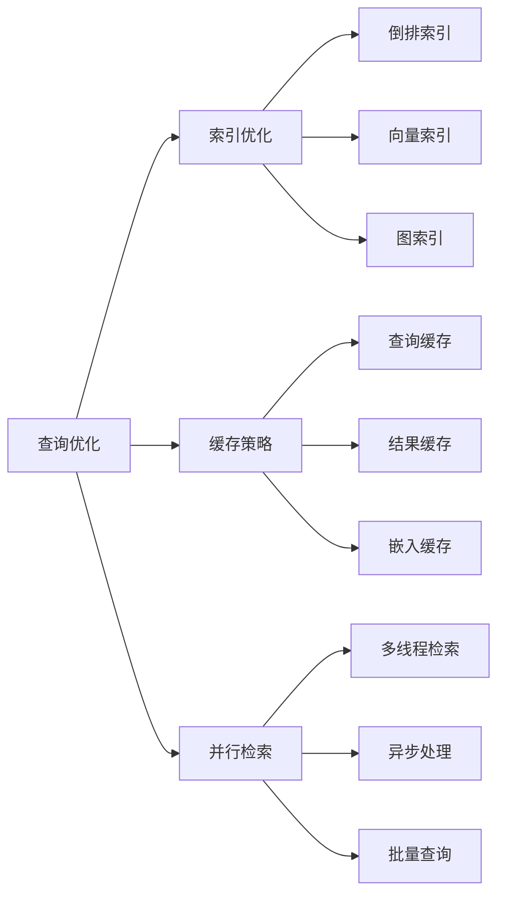

## 4. 生成增强功能

### 4.1 上下文整合

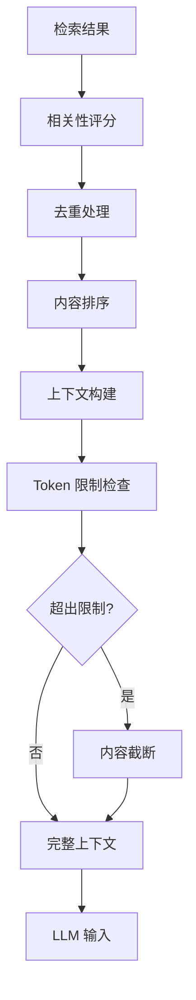

### 4.2 答案生成策略

```python
# 生成配置
GENERATION_CONFIG = {
    "max_tokens": 2000,
    "temperature": 0.1,
    "top_p": 0.9,
    "stream": True,
    "include_sources": True,
    "citation_format": "markdown"
}
```

### 4.3 多轮对话支持

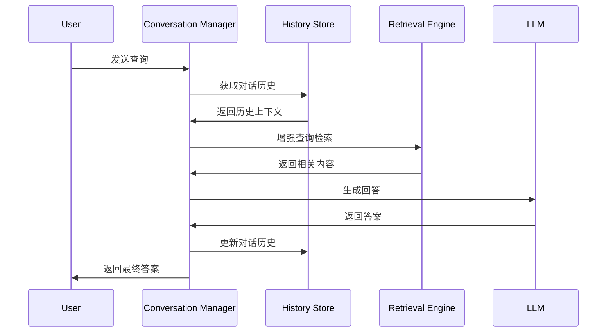

## 5. 高级功能特性

### 5.1 重排序优化

```python
# 重排序配置
RERANK_CONFIG = {
    "enabled": True,
    "model": "BAAI/bge-reranker-v2-m3",
    "top_k": 10,
    "score_threshold": 0.5,
    "rerank_mode": "mix"  # 推荐使用 mix 模式
}
```

### 5.2 批量处理

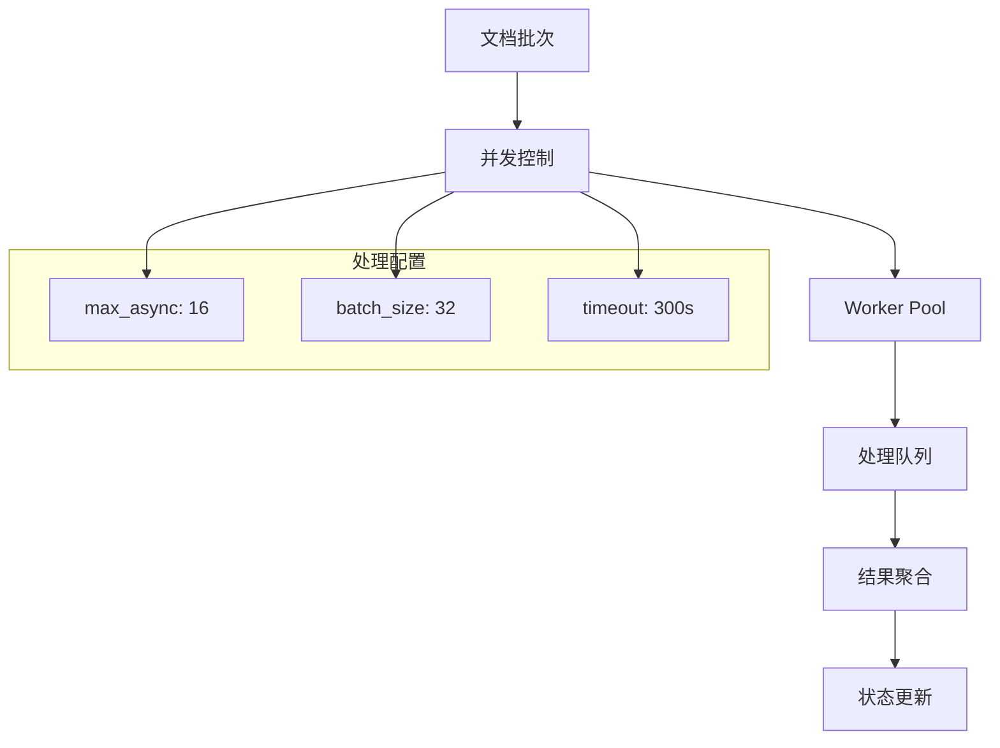

### 5.3 API 集成

```python
# API 使用示例
from lightrag import LightRAG

# 初始化
rag = LightRAG(
    working_dir="./ragtest",
    llm_model_func=llm_model_func,
    embedding_func=embedding_func
)

# 插入文档
rag.insert("Your document content here")

# 查询
result = rag.query(
    "Your question here", 
    param=QueryParam(mode="hybrid")
)

# 流式查询
for chunk in rag.query_stream("Your question"):
    print(chunk, end="")
```

## 6. 性能监控

### 6.1 关键指标

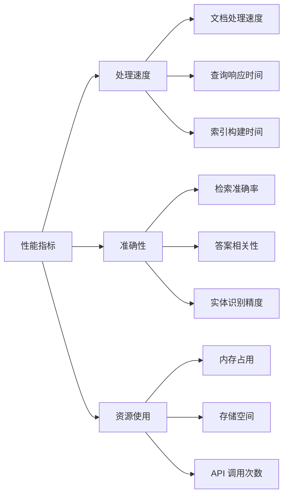

### 6.2 调试工具

```python
# 调试配置
DEBUG_CONFIG = {
    "log_level": "DEBUG",
    "enable_profiling": True,
    "trace_retrieval": True,
    "save_intermediate_results": True,
    "performance_metrics": True
}
```

这些核心功能构成了 LightRAG 的完整功能体系，为用户提供了强大而灵活的 RAG 解决方案。
