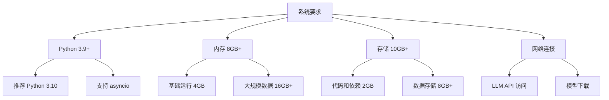
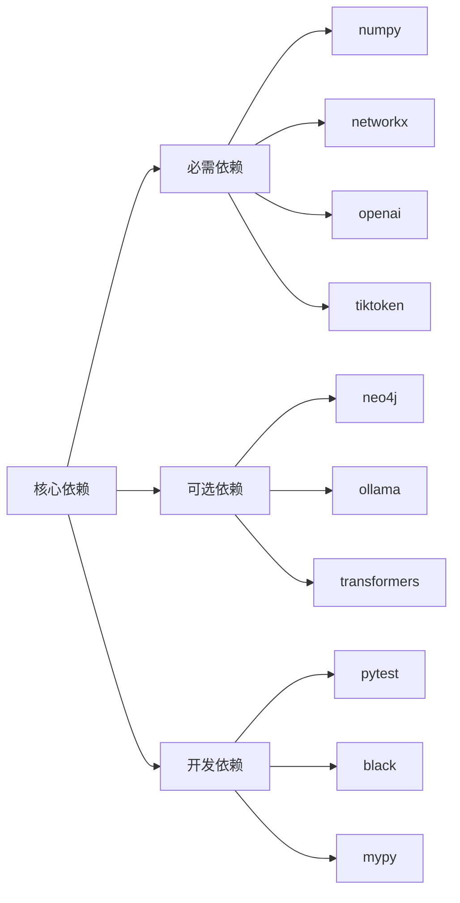
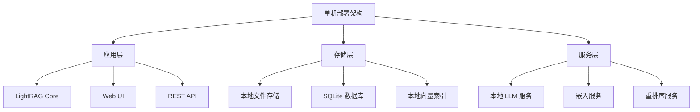
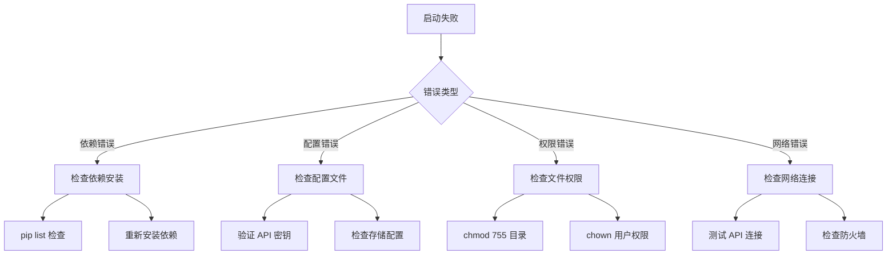

# LightRAG 安装部署指南

## 快速开始

### 1. 环境要求



### 2. 基础安装

```bash
# 方式一：从 PyPI 安装
pip install lightrag-hku

# 方式二：从源码安装
git clone https://github.com/HKUDS/LightRAG.git
cd LightRAG
pip install -e .

# 方式三：使用 conda
conda create -n lightrag python=3.10
conda activate lightrag
pip install lightrag-hku
```

### 3. 依赖管理



## 配置管理

### 1. 环境变量配置

```bash
# .env 文件示例
# LLM 配置
OPENAI_API_KEY=your_openai_api_key
OPENAI_BASE_URL=https://api.openai.com/v1
LLM_MODEL=gpt-4o-mini

# 嵌入模型配置
EMBEDDING_MODEL=text-embedding-3-large
EMBEDDING_DIM=3072

# 存储配置
WORKING_DIR=./ragtest
STORAGE_TYPE=json  # json, postgresql, neo4j

# 性能配置
MAX_ASYNC=16
BATCH_SIZE=32
CHUNK_TOKEN_SIZE=1200
CHUNK_OVERLAP_TOKEN_SIZE=100

# 调试配置
LOG_LEVEL=INFO
ENABLE_CACHE=true
```

### 2. 配置文件结构

```python
# config.py
from dataclasses import dataclass
from typing import Optional

@dataclass
class LightRAGConfig:
    # LLM 配置
    llm_model: str = "gpt-4o-mini"
    llm_api_key: Optional[str] = None
    llm_base_url: Optional[str] = None
    
    # 嵌入配置
    embedding_model: str = "text-embedding-3-large"
    embedding_dim: int = 3072
    
    # 存储配置
    working_dir: str = "./ragtest"
    storage_type: str = "json"
    
    # 性能配置
    max_async: int = 16
    batch_size: int = 32
    chunk_token_size: int = 1200
    chunk_overlap_token_size: int = 100
    
    # 检索配置
    enable_rerank: bool = True
    rerank_model: str = "BAAI/bge-reranker-v2-m3"
    
    # 调试配置
    log_level: str = "INFO"
    enable_cache: bool = True
```

## 部署方案

### 1. 单机部署



**单机部署脚本：**
```bash
#!/bin/bash
# deploy_single.sh

# 1. 创建工作目录
mkdir -p /opt/lightrag
cd /opt/lightrag

# 2. 创建虚拟环境
python -m venv venv
source venv/bin/activate

# 3. 安装依赖
pip install lightrag-hku
pip install "fastapi[all]" uvicorn

# 4. 创建配置文件
cat > config.py << EOF
from lightrag import LightRAG, QueryParam
import os

# 配置 LightRAG
rag = LightRAG(
    working_dir="./ragtest",
    llm_model_func=your_llm_model_func,
    embedding_func=your_embedding_func
)
EOF

# 5. 启动服务
python -m uvicorn main:app --host 0.0.0.0 --port 8000
```

### 2. Docker 部署

```dockerfile
# Dockerfile
FROM python:3.10-slim

WORKDIR /app

# 安装系统依赖
RUN apt-get update && apt-get install -y \
    git \
    curl \
    && rm -rf /var/lib/apt/lists/*

# 复制依赖文件
COPY requirements.txt .
RUN pip install --no-cache-dir -r requirements.txt

# 复制应用代码
COPY . .

# 创建数据目录
RUN mkdir -p /app/data

# 暴露端口
EXPOSE 8000

# 启动命令
CMD ["python", "-m", "uvicorn", "main:app", "--host", "0.0.0.0", "--port", "8000"]
```

```yaml
# docker-compose.yml
version: '3.8'

services:
  lightrag:
    build: .
    ports:
      - "8000:8000"
    environment:
      - OPENAI_API_KEY=${OPENAI_API_KEY}
      - WORKING_DIR=/app/data
    volumes:
      - ./data:/app/data
      - ./config:/app/config
    restart: unless-stopped
    
  postgres:
    image: pgvector/pgvector:pg16
    environment:
      - POSTGRES_DB=lightrag
      - POSTGRES_USER=lightrag
      - POSTGRES_PASSWORD=password
    volumes:
      - postgres_data:/var/lib/postgresql/data
    ports:
      - "5432:5432"
    
  neo4j:
    image: neo4j:5.15
    environment:
      - NEO4J_AUTH=neo4j/password
      - NEO4J_PLUGINS=["graph-data-science"]
    volumes:
      - neo4j_data:/data
    ports:
      - "7474:7474"
      - "7687:7687"

volumes:
  postgres_data:
  neo4j_data:
```

### 3. Kubernetes 部署

```yaml
# k8s-deployment.yaml
apiVersion: apps/v1
kind: Deployment
metadata:
  name: lightrag-deployment
spec:
  replicas: 3
  selector:
    matchLabels:
      app: lightrag
  template:
    metadata:
      labels:
        app: lightrag
    spec:
      containers:
      - name: lightrag
        image: lightrag:latest
        ports:
        - containerPort: 8000
        env:
        - name: OPENAI_API_KEY
          valueFrom:
            secretKeyRef:
              name: lightrag-secrets
              key: openai-api-key
        - name: WORKING_DIR
          value: "/app/data"
        volumeMounts:
        - name: data-volume
          mountPath: /app/data
        resources:
          requests:
            memory: "2Gi"
            cpu: "500m"
          limits:
            memory: "4Gi"
            cpu: "1000m"
      volumes:
      - name: data-volume
        persistentVolumeClaim:
          claimName: lightrag-pvc

---
apiVersion: v1
kind: Service
metadata:
  name: lightrag-service
spec:
  selector:
    app: lightrag
  ports:
  - protocol: TCP
    port: 80
    targetPort: 8000
  type: LoadBalancer
```

## 存储后端配置

### 1. PostgreSQL 配置

```python
# postgresql_config.py
from lightrag.storage import PGKVStorage, PGVectorStorage, PGGraphStorage

# 数据库连接配置
DB_CONFIG = {
    "host": "localhost",
    "port": 5432,
    "database": "lightrag",
    "user": "lightrag",
    "password": "password"
}

# 初始化存储
kv_storage = PGKVStorage(
    namespace="lightrag_kv",
    global_config=DB_CONFIG
)

vector_storage = PGVectorStorage(
    namespace="lightrag_vector",
    global_config=DB_CONFIG,
    embedding_dim=3072
)

graph_storage = PGGraphStorage(
    namespace="lightrag_graph",
    global_config=DB_CONFIG
)
```

### 2. Neo4j 配置

```python
# neo4j_config.py
from lightrag.storage import Neo4JStorage

# Neo4j 连接配置
NEO4J_CONFIG = {
    "uri": "bolt://localhost:7687",
    "username": "neo4j",
    "password": "password"
}

# 初始化图存储
graph_storage = Neo4JStorage(
    namespace="lightrag",
    global_config=NEO4J_CONFIG
)
```

### 3. 向量数据库配置

```python
# vector_db_config.py
from lightrag.storage import (
    ChromaVectorDBStorage,
    MilvusVectorDBStorage,
    FaissVectorDBStorage
)

# Chroma 配置
chroma_storage = ChromaVectorDBStorage(
    namespace="lightrag_chroma",
    global_config={
        "persist_directory": "./chroma_db",
        "collection_name": "lightrag_collection"
    }
)

# Milvus 配置
milvus_storage = MilvusVectorDBStorage(
    namespace="lightrag_milvus",
    global_config={
        "host": "localhost",
        "port": 19530,
        "collection_name": "lightrag_collection",
        "embedding_dim": 3072
    }
)
```

## 性能优化

### 1. 缓存配置

```python
# cache_config.py
CACHE_CONFIG = {
    "llm_cache": {
        "enabled": True,
        "max_size": 1000,
        "ttl": 3600  # 1小时
    },
    "embedding_cache": {
        "enabled": True,
        "max_size": 5000,
        "ttl": 86400  # 24小时
    },
    "query_cache": {
        "enabled": True,
        "max_size": 500,
        "ttl": 1800  # 30分钟
    }
}
```

### 2. 并发配置

```python
# concurrency_config.py
CONCURRENCY_CONFIG = {
    "max_async": 16,           # 最大异步任务数
    "batch_size": 32,          # 批处理大小
    "worker_threads": 4,       # 工作线程数
    "connection_pool_size": 20, # 连接池大小
    "timeout": 300             # 超时时间（秒）
}
```

## 监控和日志

### 1. 日志配置

```python
# logging_config.py
import logging
from logging.handlers import RotatingFileHandler

# 配置日志
logging.basicConfig(
    level=logging.INFO,
    format='%(asctime)s - %(name)s - %(levelname)s - %(message)s',
    handlers=[
        RotatingFileHandler(
            'lightrag.log',
            maxBytes=10*1024*1024,  # 10MB
            backupCount=5
        ),
        logging.StreamHandler()
    ]
)
```

### 2. 健康检查

```python
# health_check.py
from fastapi import FastAPI
from lightrag import LightRAG

app = FastAPI()

@app.get("/health")
async def health_check():
    """健康检查端点"""
    try:
        # 检查 LightRAG 状态
        status = await check_lightrag_status()
        return {"status": "healthy", "details": status}
    except Exception as e:
        return {"status": "unhealthy", "error": str(e)}

async def check_lightrag_status():
    """检查 LightRAG 各组件状态"""
    return {
        "storage": "connected",
        "llm": "available",
        "embedding": "available"
    }
```

## 故障排除

### 1. 常见问题诊断



### 2. 性能调优

```python
# performance_tuning.py
PERFORMANCE_TIPS = {
    "内存优化": {
        "batch_size": "根据内存大小调整",
        "chunk_size": "平衡精度和性能",
        "cache_size": "合理设置缓存大小"
    },
    "速度优化": {
        "max_async": "增加并发数",
        "use_rerank": "启用重排序",
        "local_llm": "使用本地模型"
    },
    "存储优化": {
        "use_postgresql": "大规模数据使用 PG",
        "vector_index": "优化向量索引",
        "graph_index": "优化图索引"
    }
}
```

这个部署指南涵盖了从基础安装到生产环境部署的完整流程，帮助用户快速上手并稳定运行 LightRAG 系统。
