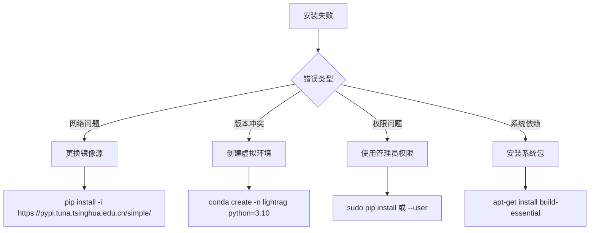
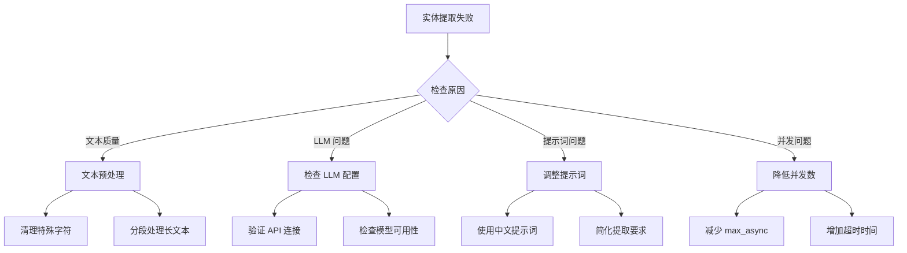
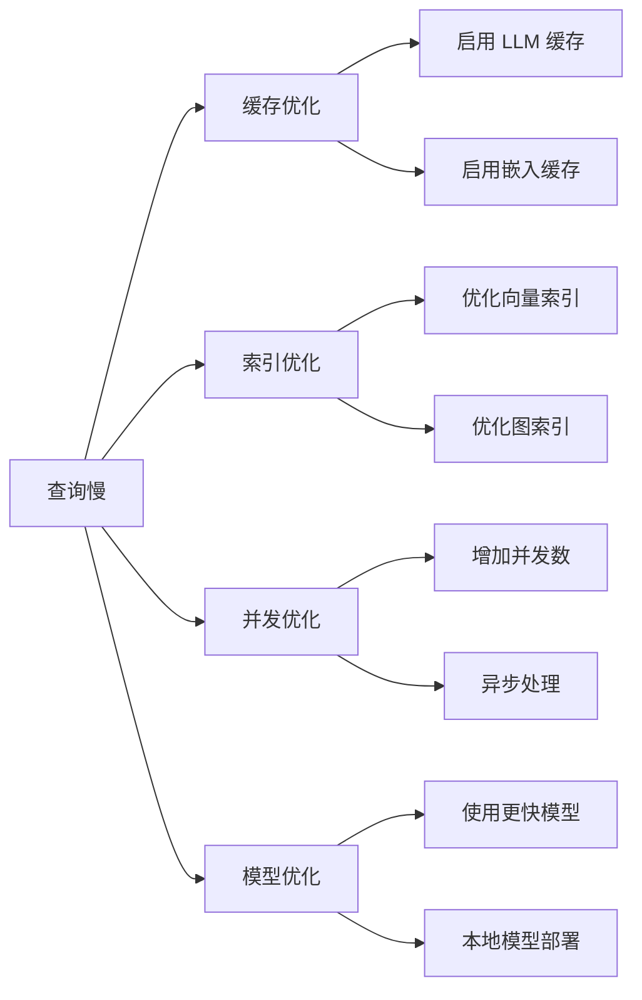

# LightRAG 常见问题解决方案

## 安装和配置问题

### 1. 依赖安装失败



**解决方案：**

```bash
# 1. 使用国内镜像源
pip install lightrag-hku -i https://pypi.tuna.tsinghua.edu.cn/simple/

# 2. 创建独立环境
conda create -n lightrag python=3.10
conda activate lightrag
pip install lightrag-hku

# 3. 安装系统依赖（Ubuntu/Debian）
sudo apt-get update
sudo apt-get install build-essential python3-dev

# 4. 安装系统依赖（CentOS/RHEL）
sudo yum groupinstall "Development Tools"
sudo yum install python3-devel
```

### 2. API 密钥配置问题

**常见错误：**
```
openai.AuthenticationError: Incorrect API key provided
```

**解决方案：**
```python
# 方法1：环境变量
import os
os.environ["OPENAI_API_KEY"] = "your-actual-api-key"

# 方法2：配置文件
# .env 文件
OPENAI_API_KEY=your-actual-api-key
OPENAI_BASE_URL=https://api.openai.com/v1

# 方法3：直接传参
rag = LightRAG(
    working_dir="./ragtest",
    llm_model_func=lambda **kwargs: openai_complete_if_cache(
        api_key="your-actual-api-key",
        **kwargs
    )
)
```

### 3. 嵌入模型不匹配问题

**错误现象：**
```
ValueError: Embedding dimension mismatch: expected 1536, got 3072
```

**解决方案：**
```python
# 确保嵌入模型和维度匹配
EMBEDDING_CONFIGS = {
    "text-embedding-3-small": {"dim": 1536},
    "text-embedding-3-large": {"dim": 3072},
    "text-embedding-ada-002": {"dim": 1536},
    "BAAI/bge-m3": {"dim": 1024},
    "BAAI/bge-large-zh-v1.5": {"dim": 1024}
}

# 正确配置
embedding_func = EmbeddingFunc(
    embedding_dim=3072,  # 与模型匹配
    max_token_size=8192,
    func=lambda texts: openai_embedding(
        texts, 
        model="text-embedding-3-large"
    )
)
```

## 运行时问题

### 1. 实体提取失败

**错误现象：**
```
WARNING: Entity extraction failed for chunk: ...
```

**诊断和解决：**



**解决代码：**
```python
# 1. 文本预处理
def preprocess_text(text: str) -> str:
    """预处理文本"""
    import re
    
    # 清理特殊字符
    text = re.sub(r'[^\w\s\u4e00-\u9fff]', ' ', text)
    
    # 合并多个空格
    text = re.sub(r'\s+', ' ', text)
    
    # 移除过短的段落
    lines = [line.strip() for line in text.split('\n') if len(line.strip()) > 10]
    
    return '\n'.join(lines)

# 2. 调整配置
rag = LightRAG(
    working_dir="./ragtest",
    llm_model_func=llm_model_func,
    embedding_func=embedding_func,
    # 降低并发数
    max_async=4,
    # 增加重试次数
    entity_extract_max_gleaning=2,
    # 调整分块大小
    chunk_token_size=800,
    chunk_overlap_token_size=100
)
```

### 2. 内存不足问题

**错误现象：**
```
MemoryError: Unable to allocate array
```

**解决策略：**

```python
# memory_optimization.py
import gc
import psutil

def optimize_memory_usage():
    """内存使用优化"""
    
    # 1. 减少批处理大小
    config = {
        "max_async": 4,  # 降低并发
        "chunk_token_size": 600,  # 减小分块
        "batch_size": 16,  # 减小批次
    }
    
    # 2. 启用垃圾回收
    gc.enable()
    gc.set_threshold(700, 10, 10)
    
    # 3. 监控内存使用
    def check_memory():
        memory = psutil.virtual_memory()
        if memory.percent > 85:
            print(f"Warning: Memory usage at {memory.percent}%")
            gc.collect()
    
    return config

# 使用优化配置
optimized_config = optimize_memory_usage()
rag = LightRAG(
    working_dir="./ragtest",
    **optimized_config
)
```

### 3. 查询响应慢问题

**性能优化方案：**



**优化代码：**
```python
# performance_optimization.py
from lightrag.utils import wrap_embedding_func_with_attrs

# 1. 启用缓存
@wrap_embedding_func_with_attrs(
    embedding_dim=3072,
    max_token_size=8192,
)
async def cached_embedding_func(texts: list[str]) -> np.ndarray:
    # 使用缓存的嵌入函数
    return await openai_embedding(
        texts,
        model="text-embedding-3-large",
        api_key=os.getenv("OPENAI_API_KEY")
    )

# 2. 优化配置
performance_config = {
    "max_async": 16,  # 增加并发
    "max_token_for_text_unit": 4000,
    "max_token_for_global_context": 8000,
    "max_token_for_local_context": 4000,
}

# 3. 使用重排序
rag = LightRAG(
    working_dir="./ragtest",
    llm_model_func=llm_model_func,
    embedding_func=cached_embedding_func,
    **performance_config
)
```

## 存储相关问题

### 1. 数据库连接失败

**PostgreSQL 连接问题：**
```python
# postgresql_troubleshooting.py
import psycopg2
from psycopg2 import OperationalError

def test_postgresql_connection():
    """测试 PostgreSQL 连接"""
    try:
        conn = psycopg2.connect(
            host="localhost",
            port=5432,
            database="lightrag",
            user="lightrag",
            password="password"
        )
        print("✓ PostgreSQL connection successful")
        conn.close()
        return True
    except OperationalError as e:
        print(f"✗ PostgreSQL connection failed: {e}")
        return False

# 连接问题解决步骤
def fix_postgresql_issues():
    """修复 PostgreSQL 连接问题"""
    print("1. 检查 PostgreSQL 服务状态:")
    print("   sudo systemctl status postgresql")
    
    print("2. 启动 PostgreSQL 服务:")
    print("   sudo systemctl start postgresql")
    
    print("3. 创建数据库和用户:")
    print("   sudo -u postgres createdb lightrag")
    print("   sudo -u postgres createuser lightrag")
    
    print("4. 安装 pgvector 扩展:")
    print("   sudo -u postgres psql -c 'CREATE EXTENSION vector;'")
```

**Neo4j 连接问题：**
```python
# neo4j_troubleshooting.py
from neo4j import GraphDatabase

def test_neo4j_connection():
    """测试 Neo4j 连接"""
    try:
        driver = GraphDatabase.driver(
            "bolt://localhost:7687",
            auth=("neo4j", "password")
        )
        
        with driver.session() as session:
            result = session.run("RETURN 1 as test")
            print("✓ Neo4j connection successful")
        
        driver.close()
        return True
    except Exception as e:
        print(f"✗ Neo4j connection failed: {e}")
        return False

# Neo4j 问题解决
def fix_neo4j_issues():
    """修复 Neo4j 连接问题"""
    print("1. 检查 Neo4j 服务:")
    print("   docker ps | grep neo4j")
    
    print("2. 启动 Neo4j 容器:")
    print("   docker run -d --name neo4j \\")
    print("     -p 7474:7474 -p 7687:7687 \\")
    print("     -e NEO4J_AUTH=neo4j/password \\")
    print("     neo4j:5.15")
    
    print("3. 检查防火墙设置")
    print("4. 验证认证信息")
```

### 2. 存储空间不足

**监控和清理：**
```python
# storage_management.py
import os
import shutil
from pathlib import Path

def check_storage_usage(working_dir: str):
    """检查存储使用情况"""
    path = Path(working_dir)
    
    if not path.exists():
        print(f"Working directory {working_dir} does not exist")
        return
    
    # 计算目录大小
    total_size = sum(
        f.stat().st_size for f in path.rglob('*') if f.is_file()
    )
    
    # 获取磁盘使用情况
    disk_usage = shutil.disk_usage(path)
    
    print(f"LightRAG data size: {total_size / (1024**3):.2f} GB")
    print(f"Available disk space: {disk_usage.free / (1024**3):.2f} GB")
    
    # 检查各个存储组件
    components = ['kv_store', 'vector_store', 'graph_store']
    for component in components:
        component_path = path / component
        if component_path.exists():
            component_size = sum(
                f.stat().st_size for f in component_path.rglob('*') if f.is_file()
            )
            print(f"{component}: {component_size / (1024**2):.2f} MB")

def cleanup_storage(working_dir: str, keep_days: int = 7):
    """清理旧的存储文件"""
    import time
    
    path = Path(working_dir)
    current_time = time.time()
    cutoff_time = current_time - (keep_days * 24 * 3600)
    
    cleaned_size = 0
    for file_path in path.rglob('*'):
        if file_path.is_file() and file_path.stat().st_mtime < cutoff_time:
            file_size = file_path.stat().st_size
            file_path.unlink()
            cleaned_size += file_size
    
    print(f"Cleaned up {cleaned_size / (1024**2):.2f} MB of old files")
```

## 模型相关问题

### 1. LLM 调用失败

**错误诊断：**
```python
# llm_troubleshooting.py
import asyncio
import openai

async def diagnose_llm_issues():
    """诊断 LLM 调用问题"""
    
    # 1. 测试 API 连接
    try:
        client = openai.AsyncOpenAI(
            api_key=os.getenv("OPENAI_API_KEY"),
            base_url=os.getenv("OPENAI_BASE_URL")
        )
        
        response = await client.chat.completions.create(
            model="gpt-4o-mini",
            messages=[{"role": "user", "content": "Hello"}],
            max_tokens=10
        )
        print("✓ LLM API connection successful")
        
    except Exception as e:
        print(f"✗ LLM API connection failed: {e}")
        return False
    
    # 2. 测试嵌入 API
    try:
        embedding_response = await client.embeddings.create(
            model="text-embedding-3-large",
            input="test text"
        )
        print("✓ Embedding API connection successful")
        
    except Exception as e:
        print(f"✗ Embedding API connection failed: {e}")
        return False
    
    return True

# 运行诊断
# asyncio.run(diagnose_llm_issues())
```

### 2. 本地模型配置

**Ollama 集成：**
```python
# ollama_integration.py
import requests
import json

def setup_ollama_models():
    """设置 Ollama 模型"""
    
    # 1. 检查 Ollama 服务
    try:
        response = requests.get("http://localhost:11434/api/tags")
        if response.status_code == 200:
            print("✓ Ollama service is running")
            models = response.json()
            print(f"Available models: {[m['name'] for m in models['models']]}")
        else:
            print("✗ Ollama service not accessible")
            return False
    except Exception as e:
        print(f"✗ Ollama connection failed: {e}")
        return False
    
    # 2. 下载推荐模型
    recommended_models = [
        "llama3.1:8b",      # 主要 LLM
        "nomic-embed-text", # 嵌入模型
    ]
    
    for model in recommended_models:
        print(f"Pulling model: {model}")
        # ollama pull {model}
    
    return True

# Ollama LLM 函数
async def ollama_llm_func(prompt, **kwargs):
    """Ollama LLM 函数"""
    import aiohttp
    
    async with aiohttp.ClientSession() as session:
        async with session.post(
            "http://localhost:11434/api/generate",
            json={
                "model": "llama3.1:8b",
                "prompt": prompt,
                "stream": False
            }
        ) as response:
            result = await response.json()
            return result["response"]
```

## 调试和监控

### 1. 日志配置

```python
# logging_setup.py
import logging
import sys
from pathlib import Path

def setup_logging(log_level: str = "INFO", log_file: str = None):
    """设置日志配置"""
    
    # 创建日志格式
    formatter = logging.Formatter(
        '%(asctime)s - %(name)s - %(levelname)s - %(message)s'
    )
    
    # 设置根日志器
    root_logger = logging.getLogger()
    root_logger.setLevel(getattr(logging, log_level.upper()))
    
    # 控制台处理器
    console_handler = logging.StreamHandler(sys.stdout)
    console_handler.setFormatter(formatter)
    root_logger.addHandler(console_handler)
    
    # 文件处理器
    if log_file:
        file_handler = logging.FileHandler(log_file)
        file_handler.setFormatter(formatter)
        root_logger.addHandler(file_handler)
    
    # 设置第三方库日志级别
    logging.getLogger("httpx").setLevel(logging.WARNING)
    logging.getLogger("openai").setLevel(logging.WARNING)
    
    return root_logger

# 使用示例
logger = setup_logging("DEBUG", "lightrag.log")
```

### 2. 错误恢复机制

```python
# error_recovery.py
import asyncio
import time
from typing import Callable, Any

class RetryableError(Exception):
    """可重试的错误"""
    pass

async def retry_with_backoff(
    func: Callable,
    max_retries: int = 3,
    base_delay: float = 1.0,
    max_delay: float = 60.0,
    backoff_factor: float = 2.0
) -> Any:
    """带退避的重试机制"""
    
    for attempt in range(max_retries + 1):
        try:
            return await func()
        except RetryableError as e:
            if attempt == max_retries:
                raise e
            
            delay = min(base_delay * (backoff_factor ** attempt), max_delay)
            print(f"Attempt {attempt + 1} failed: {e}. Retrying in {delay:.1f}s...")
            await asyncio.sleep(delay)
        except Exception as e:
            # 非可重试错误直接抛出
            raise e

# 使用示例
async def robust_query(rag, query: str, mode: str = "hybrid"):
    """带错误恢复的查询"""
    
    async def _query():
        try:
            return await rag.aquery(query, param=QueryParam(mode=mode))
        except (ConnectionError, TimeoutError) as e:
            raise RetryableError(f"Network error: {e}")
        except Exception as e:
            if "rate limit" in str(e).lower():
                raise RetryableError(f"Rate limit error: {e}")
            raise e
    
    return await retry_with_backoff(_query)
```

这个问题解决指南涵盖了 LightRAG 使用过程中最常见的问题和解决方案，帮助用户快速定位和解决各种技术难题。
