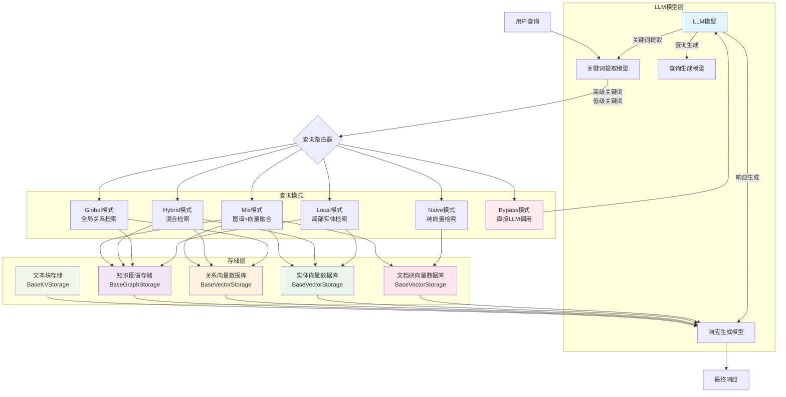
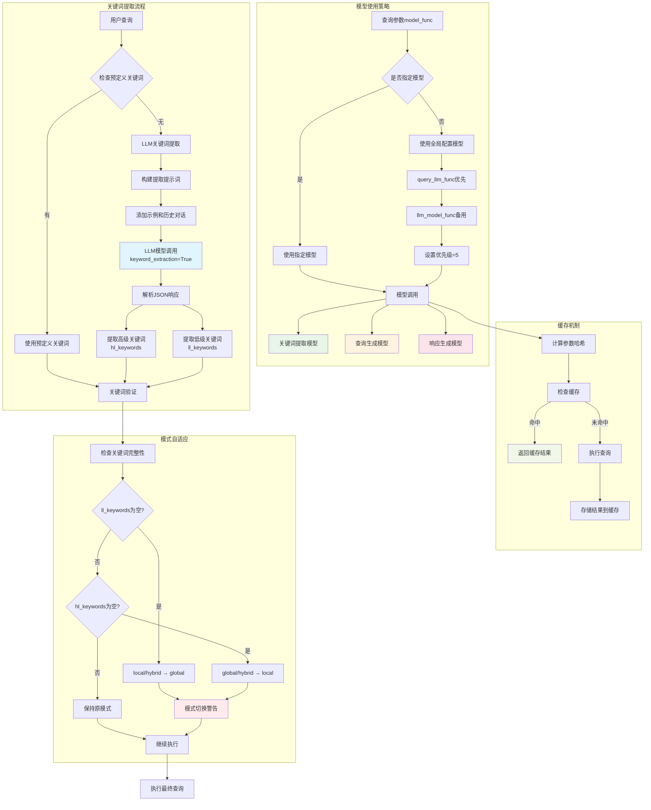
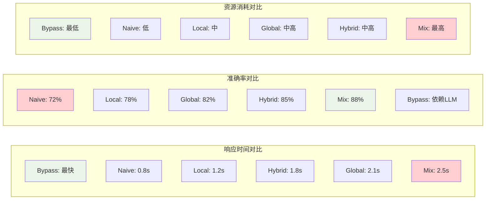
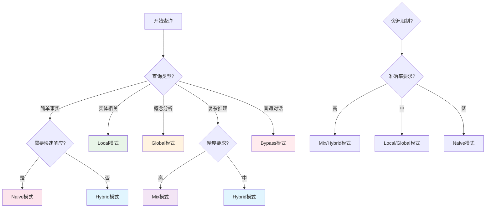

# LightRAG 查询模式流程图

本文档包含LightRAG各种查询模式的详细流程图，帮助理解每种模式的工作原理。

## 整体架构图

## 六种查询模式详细流程

```mermaid
graph TD
    subgraph "1. Naive模式 - 纯向量检索"
        N1[用户查询] --> N2[直接向量搜索]
        N2 --> N3[文档块向量数据库<br/>chunks_vdb.query]
        N3 --> N4[获取相似文档块]
        N4 --> N5[LLM生成响应]
        N5 --> N6[返回结果]
    end
    
    subgraph "2. Local模式 - 局部实体检索"
        L1[用户查询] --> L2[LLM提取低级关键词<br/>ll_keywords]
        L2 --> L3[实体向量搜索<br/>entities_vdb.query]
        L3 --> L4[获取相关实体]
        L4 --> L5[知识图谱查询<br/>get_nodes_batch]
        L5 --> L6[获取实体邻域关系]
        L6 --> L7[构建局部上下文]
        L7 --> L8[LLM生成响应]
        L8 --> L9[返回结果]
    end
    
    subgraph "3. Global模式 - 全局关系检索"
        G1[用户查询] --> G2[LLM提取高级关键词<br/>hl_keywords]
        G2 --> G3[关系向量搜索<br/>relationships_vdb.query]
        G3 --> G4[获取相关关系]
        G4 --> G5[知识图谱查询<br/>get_edges_batch]
        G5 --> G6[获取全局关系网络]
        G6 --> G7[构建全局上下文]
        G7 --> G8[LLM生成响应]
        G8 --> G9[返回结果]
    end
    
    subgraph "4. Hybrid模式 - 混合检索"
        H1[用户查询] --> H2[LLM提取双层关键词<br/>hl_keywords + ll_keywords]
        H2 --> H3[并行执行Local和Global]
        H3 --> H4[合并实体和关系上下文]
        H4 --> H5[统一处理和排序]
        H5 --> H6[LLM生成响应]
        H6 --> H7[返回结果]
    end
    
    subgraph "5. Mix模式 - 图谱+向量融合"
        M1[用户查询] --> M2[LLM提取双层关键词]
        M2 --> M3[三路并行检索]
        M3 --> M4[向量检索<br/>chunks_vdb]
        M3 --> M5[实体检索<br/>entities_vdb]
        M3 --> M6[关系检索<br/>relationships_vdb]
        M4 --> M7[融合所有上下文]
        M5 --> M7
        M6 --> M7
        M7 --> M8[统一重排序]
        M8 --> M9[LLM生成响应]
        M9 --> M10[返回结果]
    end
    
    subgraph "6. Bypass模式 - 直接LLM调用"
        B1[用户查询] --> B2[跳过所有检索]
        B2 --> B3[直接LLM调用<br/>最高优先级8]
        B3 --> B4[支持对话历史]
        B4 --> B5[返回结果]
    end
    
    style N3 fill:#fce4ec
    style L3 fill:#e8f5e8
    style L5 fill:#f3e5f5
    style G3 fill:#fff3e0
    style G5 fill:#f3e5f5
    style M4 fill:#fce4ec
    style M5 fill:#e8f5e8
    style M6 fill:#fff3e0
    style B3 fill:#ffebee
```

## 关键词提取与模型使用流程

## 性能对比图

## 模式选择决策树

## 使用建议

### 模式选择矩阵

| 查询特征 | 推荐模式 | 备选模式 |
|----------|----------|----------|
| 简单事实查询 | Naive | Hybrid |
| 实体关系查询 | Local | Mix |
| 概念性查询 | Global | Hybrid |
| 复杂推理查询 | Mix | Hybrid |
| 快速响应需求 | Naive | Bypass |
| 高精度需求 | Mix | Hybrid |
| 资源受限 | Naive | Bypass |
| 普通对话 | Bypass | - |

### 性能调优建议

1. **Naive模式**: 适合快速原型和简单查询
2. **Local模式**: 调整`top_k`参数优化实体检索
3. **Global模式**: 关注关系质量和图谱完整性
4. **Hybrid模式**: 平衡性能和准确性的最佳选择
5. **Mix模式**: 最高精度，适合关键业务场景
6. **Bypass模式**: 用于对话和不需要检索的场景

这些流程图帮助开发者理解每种查询模式的内部工作机制，从而做出最适合的选择。
