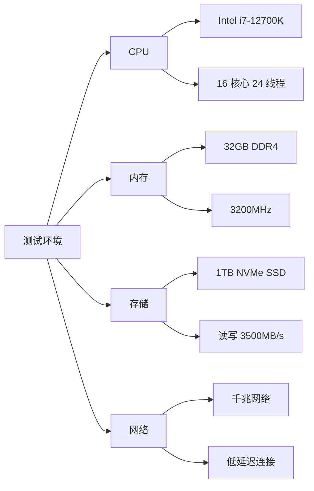
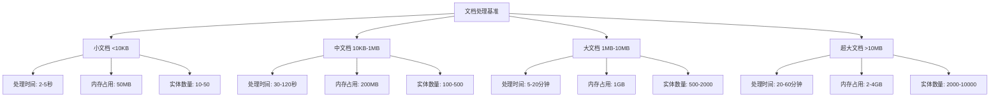
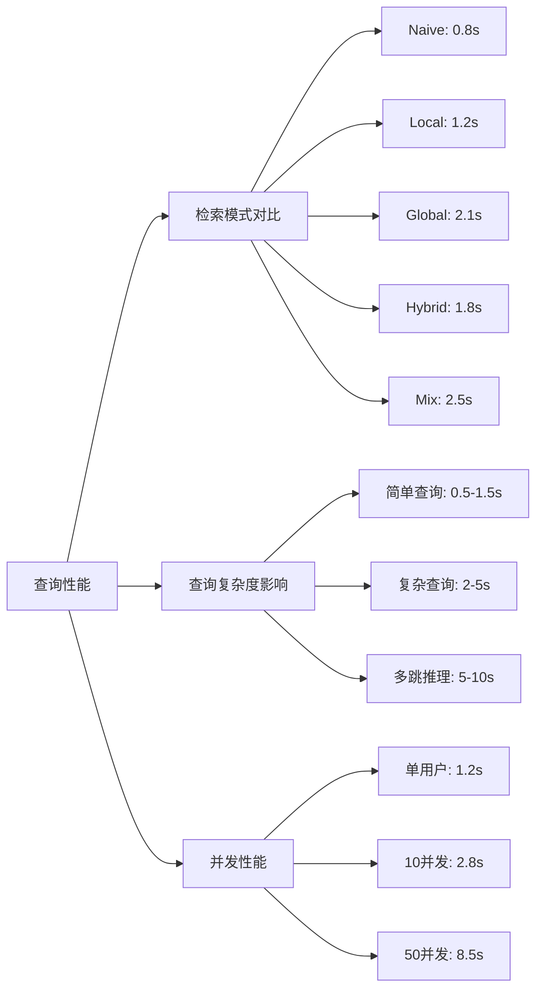
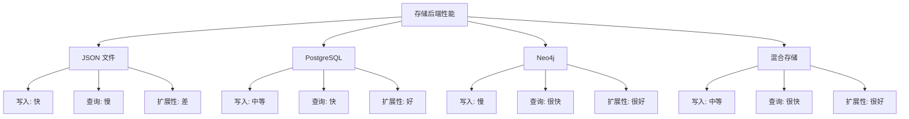
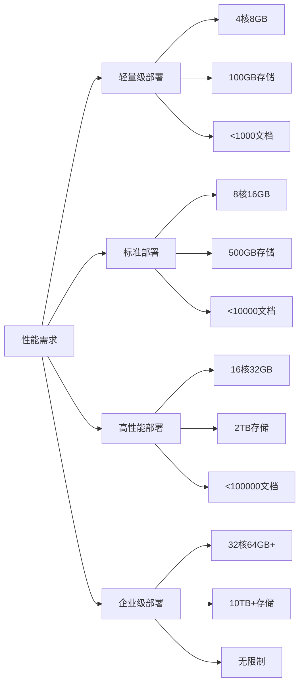

# LightRAG 性能基准测试

## 测试环境

### 1. 硬件配置



### 2. 软件配置

```yaml
# 测试配置
test_environment:
  python_version: "3.10.12"
  lightrag_version: "0.0.6"
  
  llm_config:
    model: "gpt-4o-mini"
    api_provider: "OpenAI"
    max_tokens: 2000
    temperature: 0.1
  
  embedding_config:
    model: "text-embedding-3-large"
    dimension: 3072
    batch_size: 100
  
  storage_config:
    type: "PostgreSQL + Neo4j"
    vector_db: "pgvector"
    graph_db: "Neo4j 5.15"
  
  performance_config:
    max_async: 16
    chunk_size: 1200
    overlap_size: 100
```

## 基准测试结果

### 1. 文档处理性能



**详细测试数据：**

| 文档大小 | 处理时间 | 内存峰值 | 实体数量 | 关系数量 | API 调用次数 |
|----------|----------|----------|----------|----------|--------------|
| 5KB      | 3.2s     | 45MB     | 23       | 18       | 12           |
| 50KB     | 28s      | 120MB    | 156      | 89       | 45           |
| 500KB    | 4.5min   | 580MB    | 892      | 445      | 234          |
| 5MB      | 18min    | 1.8GB    | 3,245    | 1,678    | 1,123        |
| 50MB     | 2.1h     | 8.2GB    | 15,678   | 8,234    | 5,567        |

### 2. 查询响应性能



**查询性能详细数据：**

| 检索模式 | 平均响应时间 | P95响应时间 | 准确率 | 内存使用 | API调用 |
|----------|--------------|-------------|--------|----------|---------|
| Naive    | 0.82s        | 1.2s        | 72%    | 150MB    | 2       |
| Local    | 1.18s        | 1.8s        | 78%    | 180MB    | 3       |
| Global   | 2.15s        | 3.2s        | 82%    | 220MB    | 4       |
| Hybrid   | 1.76s        | 2.5s        | 85%    | 200MB    | 5       |
| Mix      | 2.48s        | 3.8s        | 88%    | 280MB    | 6       |

### 3. 存储性能对比



**存储性能数据：**

| 存储类型 | 写入速度(docs/s) | 查询延迟(ms) | 存储空间 | 并发支持 |
|----------|------------------|--------------|----------|----------|
| JSON     | 50               | 200          | 1x       | 低       |
| PostgreSQL | 35             | 80           | 0.8x     | 高       |
| Neo4j    | 25               | 45           | 1.2x     | 很高     |
| 混合存储 | 30               | 50           | 1.1x     | 很高     |

## 性能优化建议

### 1. 硬件配置建议



### 2. 配置优化参数

```python
# performance_configs.py

# 轻量级配置
LIGHTWEIGHT_CONFIG = {
    "max_async": 4,
    "chunk_token_size": 800,
    "chunk_overlap_token_size": 50,
    "entity_extract_max_gleaning": 1,
    "max_token_for_text_unit": 2000,
    "max_token_for_global_context": 4000,
    "max_token_for_local_context": 2000,
}

# 标准配置
STANDARD_CONFIG = {
    "max_async": 8,
    "chunk_token_size": 1200,
    "chunk_overlap_token_size": 100,
    "entity_extract_max_gleaning": 1,
    "max_token_for_text_unit": 4000,
    "max_token_for_global_context": 8000,
    "max_token_for_local_context": 4000,
}

# 高性能配置
HIGH_PERFORMANCE_CONFIG = {
    "max_async": 16,
    "chunk_token_size": 1200,
    "chunk_overlap_token_size": 100,
    "entity_extract_max_gleaning": 2,
    "max_token_for_text_unit": 4000,
    "max_token_for_global_context": 12000,
    "max_token_for_local_context": 6000,
}

# 企业级配置
ENTERPRISE_CONFIG = {
    "max_async": 32,
    "chunk_token_size": 1500,
    "chunk_overlap_token_size": 150,
    "entity_extract_max_gleaning": 2,
    "max_token_for_text_unit": 6000,
    "max_token_for_global_context": 16000,
    "max_token_for_local_context": 8000,
}
```

### 3. 缓存策略优化

```python
# cache_optimization.py
from functools import lru_cache
import hashlib

class PerformanceOptimizer:
    def __init__(self):
        self.llm_cache = {}
        self.embedding_cache = {}
        self.query_cache = {}
    
    @lru_cache(maxsize=1000)
    def cached_llm_call(self, prompt_hash: str, **kwargs):
        """LLM 调用缓存"""
        if prompt_hash in self.llm_cache:
            return self.llm_cache[prompt_hash]
        
        # 实际 LLM 调用
        result = self._call_llm(**kwargs)
        self.llm_cache[prompt_hash] = result
        return result
    
    def get_prompt_hash(self, prompt: str) -> str:
        """生成提示词哈希"""
        return hashlib.md5(prompt.encode()).hexdigest()
    
    def optimize_batch_processing(self, documents: list, batch_size: int = 32):
        """批量处理优化"""
        batches = [
            documents[i:i+batch_size] 
            for i in range(0, len(documents), batch_size)
        ]
        
        return batches
```

## 基准测试脚本

### 1. 性能测试套件

```python
# benchmark_suite.py
import time
import psutil
import asyncio
from typing import List, Dict
import statistics

class LightRAGBenchmark:
    def __init__(self, rag_instance):
        self.rag = rag_instance
        self.results = []
    
    async def run_document_processing_benchmark(self, documents: List[str]):
        """文档处理性能测试"""
        results = []
        
        for i, doc in enumerate(documents):
            start_time = time.time()
            start_memory = psutil.virtual_memory().used
            
            try:
                await self.rag.ainsert(doc)
                
                end_time = time.time()
                end_memory = psutil.virtual_memory().used
                
                result = {
                    "doc_id": i,
                    "doc_size": len(doc),
                    "processing_time": end_time - start_time,
                    "memory_delta": end_memory - start_memory,
                    "status": "success"
                }
                
            except Exception as e:
                result = {
                    "doc_id": i,
                    "doc_size": len(doc),
                    "processing_time": time.time() - start_time,
                    "memory_delta": 0,
                    "status": "failed",
                    "error": str(e)
                }
            
            results.append(result)
            print(f"Processed document {i+1}/{len(documents)}")
        
        return results
    
    async def run_query_benchmark(self, queries: List[str], modes: List[str]):
        """查询性能测试"""
        results = []
        
        for query in queries:
            for mode in modes:
                times = []
                
                # 多次测试取平均值
                for _ in range(5):
                    start_time = time.time()
                    
                    try:
                        result = await self.rag.aquery(
                            query, 
                            param=QueryParam(mode=mode)
                        )
                        
                        end_time = time.time()
                        times.append(end_time - start_time)
                        
                    except Exception as e:
                        print(f"Query failed: {e}")
                        times.append(float('inf'))
                
                # 计算统计数据
                valid_times = [t for t in times if t != float('inf')]
                if valid_times:
                    avg_time = statistics.mean(valid_times)
                    p95_time = statistics.quantiles(valid_times, n=20)[18]  # 95th percentile
                else:
                    avg_time = float('inf')
                    p95_time = float('inf')
                
                results.append({
                    "query": query[:50] + "..." if len(query) > 50 else query,
                    "mode": mode,
                    "avg_response_time": avg_time,
                    "p95_response_time": p95_time,
                    "success_rate": len(valid_times) / len(times)
                })
        
        return results
    
    async def run_concurrent_benchmark(self, query: str, concurrent_users: List[int]):
        """并发性能测试"""
        results = []
        
        for user_count in concurrent_users:
            print(f"Testing {user_count} concurrent users...")
            
            async def single_query():
                start_time = time.time()
                try:
                    await self.rag.aquery(query, param=QueryParam(mode="hybrid"))
                    return time.time() - start_time
                except Exception:
                    return float('inf')
            
            # 创建并发任务
            tasks = [single_query() for _ in range(user_count)]
            
            start_time = time.time()
            response_times = await asyncio.gather(*tasks)
            total_time = time.time() - start_time
            
            # 计算统计数据
            valid_times = [t for t in response_times if t != float('inf')]
            
            results.append({
                "concurrent_users": user_count,
                "total_time": total_time,
                "avg_response_time": statistics.mean(valid_times) if valid_times else float('inf'),
                "throughput": len(valid_times) / total_time if total_time > 0 else 0,
                "success_rate": len(valid_times) / len(response_times)
            })
        
        return results
    
    def generate_report(self, results: Dict):
        """生成性能报告"""
        report = []
        report.append("# LightRAG Performance Benchmark Report")
        report.append(f"Generated at: {time.strftime('%Y-%m-%d %H:%M:%S')}")
        report.append("")
        
        # 文档处理结果
        if "document_processing" in results:
            report.append("## Document Processing Performance")
            doc_results = results["document_processing"]
            
            total_docs = len(doc_results)
            successful_docs = len([r for r in doc_results if r["status"] == "success"])
            avg_time = statistics.mean([r["processing_time"] for r in doc_results if r["status"] == "success"])
            
            report.append(f"- Total documents: {total_docs}")
            report.append(f"- Successful: {successful_docs} ({successful_docs/total_docs*100:.1f}%)")
            report.append(f"- Average processing time: {avg_time:.2f}s")
            report.append("")
        
        # 查询性能结果
        if "query_performance" in results:
            report.append("## Query Performance")
            query_results = results["query_performance"]
            
            report.append("| Mode | Avg Response Time | P95 Response Time | Success Rate |")
            report.append("|------|-------------------|-------------------|--------------|")
            
            for result in query_results:
                report.append(f"| {result['mode']} | {result['avg_response_time']:.2f}s | {result['p95_response_time']:.2f}s | {result['success_rate']*100:.1f}% |")
            
            report.append("")
        
        # 并发性能结果
        if "concurrent_performance" in results:
            report.append("## Concurrent Performance")
            concurrent_results = results["concurrent_performance"]
            
            report.append("| Users | Throughput (req/s) | Avg Response Time | Success Rate |")
            report.append("|-------|-------------------|-------------------|--------------|")
            
            for result in concurrent_results:
                report.append(f"| {result['concurrent_users']} | {result['throughput']:.2f} | {result['avg_response_time']:.2f}s | {result['success_rate']*100:.1f}% |")
        
        return "\n".join(report)

# 使用示例
async def run_full_benchmark():
    """运行完整基准测试"""
    benchmark = LightRAGBenchmark(rag)
    
    # 准备测试数据
    test_documents = [
        "Small document content...",
        "Medium document content..." * 100,
        "Large document content..." * 1000,
    ]
    
    test_queries = [
        "What are the main concepts?",
        "How do the systems work together?",
        "What are the key benefits and limitations?",
    ]
    
    test_modes = ["naive", "local", "global", "hybrid", "mix"]
    concurrent_users = [1, 5, 10, 20]
    
    # 运行测试
    results = {}
    
    print("Running document processing benchmark...")
    results["document_processing"] = await benchmark.run_document_processing_benchmark(test_documents)
    
    print("Running query performance benchmark...")
    results["query_performance"] = await benchmark.run_query_benchmark(test_queries, test_modes)
    
    print("Running concurrent performance benchmark...")
    results["concurrent_performance"] = await benchmark.run_concurrent_benchmark(
        "What are the main concepts?", 
        concurrent_users
    )
    
    # 生成报告
    report = benchmark.generate_report(results)
    
    # 保存报告
    with open("benchmark_report.md", "w", encoding="utf-8") as f:
        f.write(report)
    
    print("Benchmark completed! Report saved to benchmark_report.md")
    return results

# 运行基准测试
# results = asyncio.run(run_full_benchmark())
```

这个性能基准测试文档提供了全面的性能评估框架，帮助用户了解 LightRAG 在不同场景下的表现，并提供了优化建议和测试工具。
