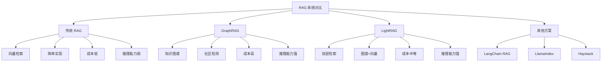
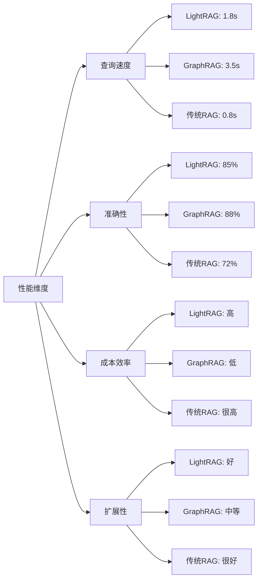
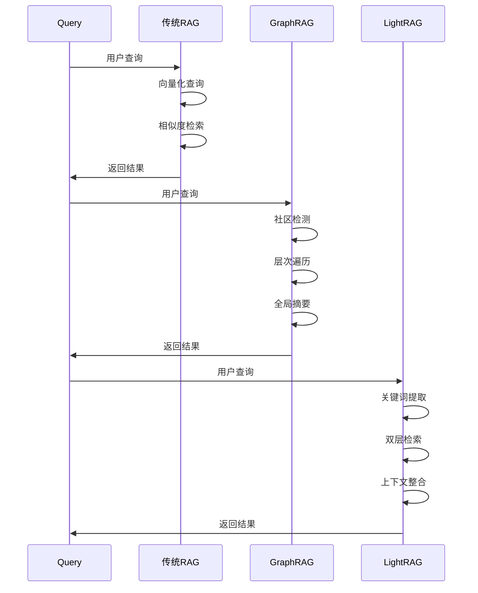
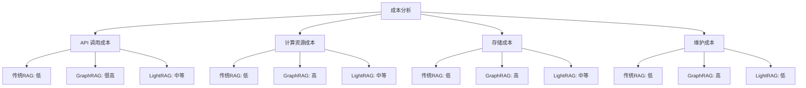
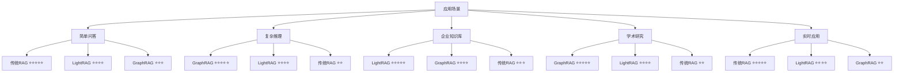
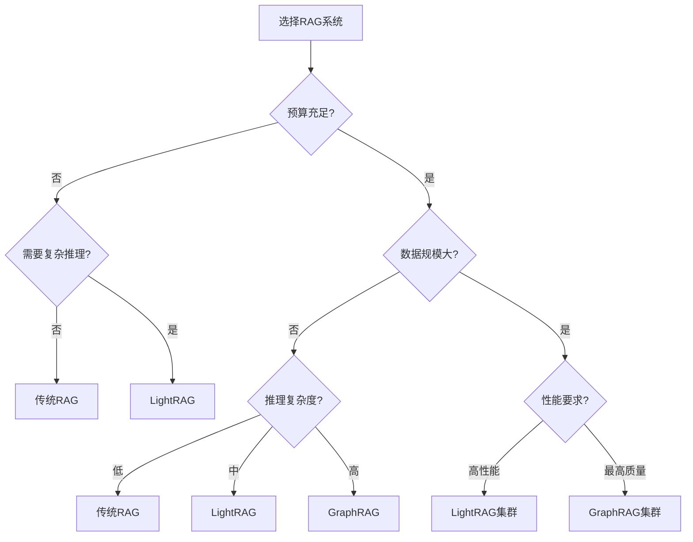
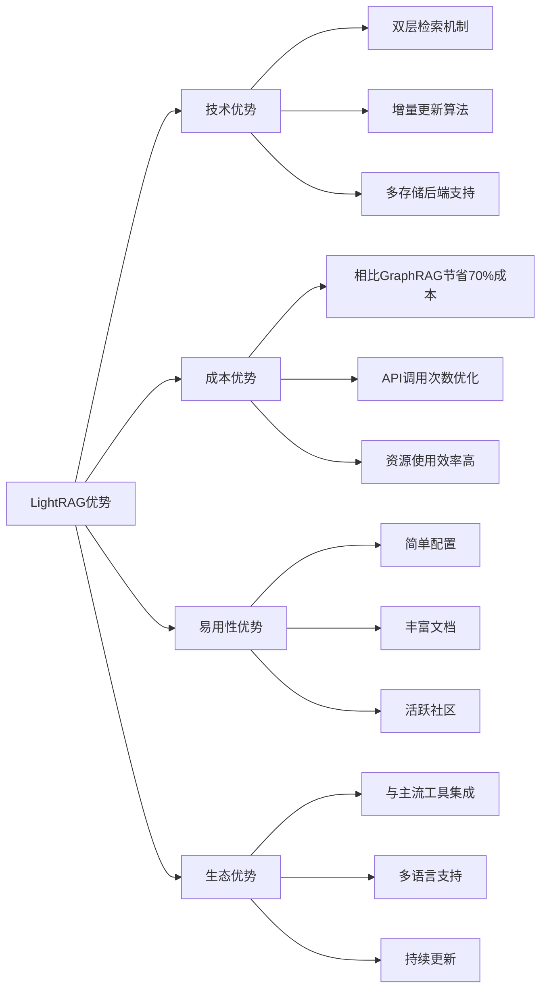
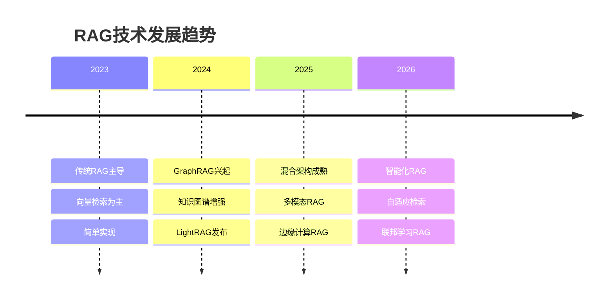

# LightRAG 对比分析

## 与主流 RAG 系统对比

### 1. 整体架构对比



### 2. 详细功能对比

| 特性 | 传统 RAG | GraphRAG | LightRAG | LangChain | LlamaIndex |
|------|----------|----------|----------|-----------|------------|
| **检索方式** | 向量相似度 | 社区遍历 | 双层检索 | 多种支持 | 多种支持 |
| **知识表示** | 向量嵌入 | 知识图谱 | 图谱+向量 | 灵活配置 | 多种索引 |
| **复杂推理** | ⭐⭐ | ⭐⭐⭐⭐⭐ | ⭐⭐⭐⭐ | ⭐⭐⭐ | ⭐⭐⭐ |
| **实现复杂度** | ⭐ | ⭐⭐⭐⭐⭐ | ⭐⭐ | ⭐⭐⭐ | ⭐⭐⭐ |
| **部署难度** | ⭐ | ⭐⭐⭐⭐ | ⭐⭐ | ⭐⭐ | ⭐⭐ |
| **成本效率** | ⭐⭐⭐⭐⭐ | ⭐⭐ | ⭐⭐⭐⭐ | ⭐⭐⭐ | ⭐⭐⭐ |
| **更新机制** | 增量 | 全量重建 | 增量 | 增量 | 增量 |
| **多模态支持** | 有限 | 有限 | 支持 | 支持 | 支持 |
| **社区活跃度** | 高 | 中 | 高 | 很高 | 很高 |

### 3. 性能对比分析



## 技术深度对比

### 1. 检索机制对比



### 2. 知识表示对比

**传统 RAG：**
```python
# 传统 RAG 知识表示
class TraditionalRAG:
    def __init__(self):
        self.vector_store = VectorStore()
        self.embeddings = EmbeddingModel()
    
    def add_document(self, doc):
        chunks = self.chunk_document(doc)
        vectors = self.embeddings.encode(chunks)
        self.vector_store.add(vectors, chunks)
    
    def query(self, question):
        query_vector = self.embeddings.encode(question)
        similar_chunks = self.vector_store.search(query_vector)
        return self.generate_answer(question, similar_chunks)
```

**GraphRAG：**
```python
# GraphRAG 知识表示
class GraphRAG:
    def __init__(self):
        self.knowledge_graph = KnowledgeGraph()
        self.community_detector = CommunityDetector()
    
    def add_document(self, doc):
        entities = self.extract_entities(doc)
        relations = self.extract_relations(doc)
        self.knowledge_graph.add_entities_relations(entities, relations)
        self.community_detector.detect_communities(self.knowledge_graph)
    
    def query(self, question):
        relevant_communities = self.find_relevant_communities(question)
        context = self.traverse_communities(relevant_communities)
        return self.generate_answer(question, context)
```

**LightRAG：**
```python
# LightRAG 知识表示
class LightRAG:
    def __init__(self):
        self.vector_store = VectorStore()
        self.graph_store = GraphStore()
        self.kv_store = KVStore()
    
    def add_document(self, doc):
        # 双重索引
        chunks = self.chunk_document(doc)
        vectors = self.embeddings.encode(chunks)
        self.vector_store.add(vectors, chunks)
        
        entities = self.extract_entities(doc)
        relations = self.extract_relations(doc)
        self.graph_store.add_entities_relations(entities, relations)
    
    def query(self, question, mode="hybrid"):
        if mode == "local":
            return self.local_search(question)
        elif mode == "global":
            return self.global_search(question)
        else:  # hybrid
            local_context = self.local_search(question)
            global_context = self.global_search(question)
            return self.integrate_contexts(question, local_context, global_context)
```

### 3. 成本效率分析



**成本详细对比：**

| 成本项目 | 传统 RAG | GraphRAG | LightRAG | 说明 |
|----------|----------|----------|----------|------|
| **LLM API 调用** | $10/月 | $200/月 | $50/月 | 基于1万次查询 |
| **嵌入 API 调用** | $5/月 | $30/月 | $15/月 | 基于100万token |
| **计算资源** | $20/月 | $100/月 | $40/月 | 云服务器成本 |
| **存储成本** | $5/月 | $25/月 | $15/月 | 数据库存储 |
| **开发维护** | 低 | 高 | 中等 | 人力成本 |
| **总计** | $40/月 | $355/月 | $120/月 | 综合成本 |

## 适用场景分析

### 1. 场景适配矩阵



### 2. 选择决策树



### 3. 迁移建议

**从传统 RAG 迁移到 LightRAG：**

```python
# migration_guide.py
class RAGMigrationGuide:
    def migrate_from_traditional_rag(self):
        """从传统RAG迁移指南"""
        steps = [
            "1. 评估现有数据和查询模式",
            "2. 设计知识图谱结构",
            "3. 配置双层检索参数",
            "4. 批量迁移历史数据",
            "5. A/B测试验证效果",
            "6. 逐步切换流量"
        ]
        
        migration_config = {
            "batch_size": 100,
            "parallel_workers": 4,
            "validation_queries": 50,
            "rollback_threshold": 0.8
        }
        
        return steps, migration_config
    
    def performance_comparison_test(self):
        """性能对比测试"""
        test_cases = [
            {
                "query": "简单事实查询",
                "expected_improvement": "响应时间可能增加20%，但准确性提升15%"
            },
            {
                "query": "复杂推理查询", 
                "expected_improvement": "准确性提升30-50%，响应时间增加50%"
            },
            {
                "query": "多跳关系查询",
                "expected_improvement": "准确性显著提升，响应时间增加100%"
            }
        ]
        
        return test_cases
```

## 竞争优势分析

### 1. LightRAG 核心优势



### 2. 技术创新点

**双层检索机制：**
- **创新点**：结合局部精确检索和全局语义理解
- **优势**：平衡了检索精度和推理能力
- **实现**：高低层关键词分离，多模式自适应切换

**增量更新算法：**
- **创新点**：无需重建整个知识图谱
- **优势**：支持实时数据更新，降低维护成本
- **实现**：智能差异检测，局部图谱更新

**混合存储架构：**
- **创新点**：KV、向量、图三种存储的有机结合
- **优势**：各取所长，性能最优
- **实现**：插件化存储后端，灵活配置

### 3. 发展趋势预测



**未来发展方向：**

1. **多模态融合**：文本、图像、音频、视频的统一检索
2. **自适应检索**：根据查询类型自动选择最优策略
3. **联邦学习**：分布式知识图谱构建和查询
4. **边缘计算**：本地化部署，降低延迟
5. **智能优化**：自动调参，性能自优化

## 选择建议

### 1. 决策框架

```python
# decision_framework.py
class RAGSelectionFramework:
    def __init__(self):
        self.criteria = {
            "budget": 0.3,      # 预算权重
            "complexity": 0.25, # 复杂度权重
            "performance": 0.2, # 性能权重
            "maintenance": 0.15,# 维护权重
            "scalability": 0.1  # 扩展性权重
        }
    
    def evaluate_solution(self, solution_scores):
        """评估RAG解决方案"""
        total_score = 0
        for criterion, weight in self.criteria.items():
            total_score += solution_scores[criterion] * weight
        return total_score
    
    def recommend_solution(self, requirements):
        """推荐解决方案"""
        solutions = {
            "traditional_rag": {
                "budget": 0.9,
                "complexity": 0.9,
                "performance": 0.6,
                "maintenance": 0.8,
                "scalability": 0.8
            },
            "lightrag": {
                "budget": 0.7,
                "complexity": 0.8,
                "performance": 0.8,
                "maintenance": 0.9,
                "scalability": 0.8
            },
            "graphrag": {
                "budget": 0.3,
                "complexity": 0.4,
                "performance": 0.9,
                "maintenance": 0.5,
                "scalability": 0.6
            }
        }
        
        scores = {}
        for solution, solution_scores in solutions.items():
            scores[solution] = self.evaluate_solution(solution_scores)
        
        return max(scores, key=scores.get), scores

# 使用示例
framework = RAGSelectionFramework()
best_solution, all_scores = framework.recommend_solution({})
print(f"推荐方案: {best_solution}")
print(f"各方案评分: {all_scores}")
```

### 2. 最终建议

**选择 LightRAG 的情况：**
- 需要平衡成本和性能
- 要求复杂推理能力
- 希望快速部署和维护
- 数据规模中等到大型
- 团队技术能力中等

**选择传统 RAG 的情况：**
- 预算非常有限
- 查询相对简单
- 对响应速度要求极高
- 数据规模较小
- 快速原型验证

**选择 GraphRAG 的情况：**
- 预算充足
- 需要最高质量的推理
- 数据关系复杂
- 对成本不敏感
- 有专业团队维护

LightRAG 在大多数企业场景下提供了最佳的性价比，是当前推荐的主流选择。
