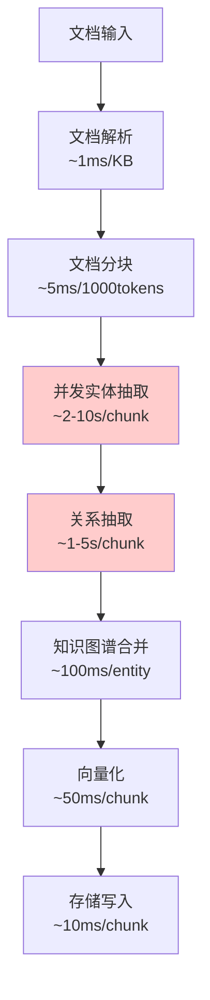
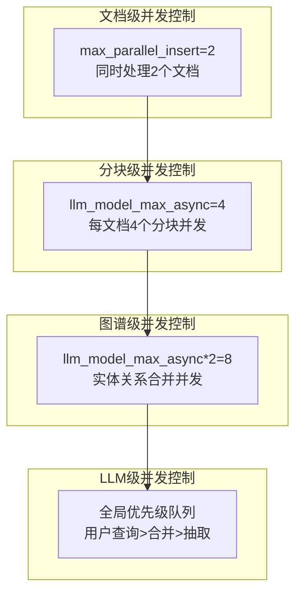

# LightRAG 文档处理性能分析

## 1. 文档处理性能概览

LightRAG的文档处理性能主要受以下因素影响：
- **LLM API调用延迟**：实体抽取和关系抽取的主要瓶颈
- **并发控制策略**：多层并发控制平衡性能和资源使用
- **文档分块算法**：Token级别的分块处理
- **缓存机制**：LLM响应缓存显著提升重复处理性能
- **存储I/O性能**：向量化和图谱存储的写入性能

## 2. 文档处理流程性能分析

### 2.1 文档处理管道


### 2.2 性能瓶颈分析

**主要瓶颈：LLM API调用**
- **实体抽取**：每个文档块需要1次LLM调用，耗时2-10秒
- **关系抽取**：在实体抽取过程中同时进行
- **知识图谱合并**：可能需要额外的LLM调用进行实体消歧

**次要瓶颈：**
- **向量化**：嵌入模型调用，通常50-200ms/chunk
- **存储I/O**：批量写入操作，10-50ms/batch
- **文档分块**：Token编码解码，5-20ms/1000tokens

## 3. 并发控制策略

### 3.1 多层并发控制
LightRAG采用三层并发控制策略：



### 3.2 并发性能计算
**理论并发数计算：**
```
总分块并发数 = max_parallel_insert × llm_model_max_async
默认配置：2 × 4 = 8个分块同时处理
```

**实际性能影响：**
- **文档级并发**：控制内存使用，避免资源竞争
- **分块级并发**：充分利用LLM并发能力
- **优先级队列**：确保用户查询响应优先级

### 3.3 并发配置优化
```bash
# 高性能配置（适合强大的LLM服务）
MAX_PARALLEL_INSERT=4      # 同时处理4个文档
MAX_ASYNC=8               # 每文档8个分块并发
EMBEDDING_FUNC_MAX_ASYNC=16  # 嵌入并发数

# 保守配置（适合API限制或资源受限）
MAX_PARALLEL_INSERT=1      # 单文档处理
MAX_ASYNC=2               # 低并发
EMBEDDING_FUNC_MAX_ASYNC=4   # 低嵌入并发
```

## 4. 文档分块性能

### 4.1 分块算法分析
```python
def chunking_by_token_size(
    tokenizer: Tokenizer,
    content: str,
    overlap_token_size: int = 128,
    max_token_size: int = 1024,
) -> list[dict[str, Any]]:
    # 时间复杂度：O(n) where n = len(content)
    # 空间复杂度：O(m) where m = number of chunks
```

**性能特征：**
- **时间复杂度**：O(n)，线性时间处理
- **内存使用**：临时存储所有Token，峰值内存 = 文档大小 × 2
- **处理速度**：~5ms/1000tokens（取决于tokenizer性能）

### 4.2 分块策略对性能的影响
```bash
# 大分块策略（减少LLM调用次数）
CHUNK_SIZE=2000           # 更大的分块
CHUNK_OVERLAP_SIZE=200    # 相应增加重叠

# 小分块策略（提高并发度）
CHUNK_SIZE=800            # 更小的分块
CHUNK_OVERLAP_SIZE=80     # 减少重叠
```

**性能权衡：**
- **大分块**：减少LLM调用次数，但单次调用时间更长
- **小分块**：增加并发度，但总调用次数增加
- **最优分块大小**：通常在1000-1500 tokens之间

## 5. LLM调用性能优化

### 5.1 缓存机制
LightRAG实现了多级缓存来优化LLM调用性能：

```python
# 缓存配置
ENABLE_LLM_CACHE=true                # 启用查询缓存
ENABLE_LLM_CACHE_FOR_EXTRACT=true    # 启用实体抽取缓存
```

**缓存效果：**
- **首次处理**：无缓存，完整LLM调用
- **重复处理**：缓存命中，~1ms响应时间
- **相似内容**：部分缓存命中，减少50-80%处理时间

### 5.2 批量处理优化
```python
# 嵌入批量处理
EMBEDDING_BATCH_NUM=10    # 批量处理10个文本块
```

**批量处理优势：**
- **减少网络开销**：单次请求处理多个文本块
- **提高吞吐量**：充分利用模型并行能力
- **降低延迟**：减少请求排队时间

## 6. 不同文档格式的性能差异

### 6.1 文档格式处理性能对比
| 格式 | 解析时间 | 分块效率 | 实体抽取质量 | 总体性能 |
|------|----------|----------|--------------|----------|
| TXT  | 最快     | 高       | 中等         | ⭐⭐⭐⭐⭐ |
| MD   | 快       | 高       | 高           | ⭐⭐⭐⭐⭐ |
| PDF  | 中等     | 中等     | 中等         | ⭐⭐⭐   |
| HTML | 慢       | 低       | 低           | ⭐⭐     |
| DOCX | 慢       | 中等     | 中等         | ⭐⭐⭐   |

### 6.2 Markdown处理性能分析
**为什么Markdown处理相对较慢？**

1. **结构化解析**：需要解析Markdown语法结构
2. **格式转换**：转换为纯文本时需要处理格式标记
3. **链接和引用处理**：需要解析和保留引用信息
4. **代码块处理**：代码块需要特殊处理逻辑

**优化策略：**
```python
# 针对Markdown的优化配置
CHUNK_SIZE=1500           # 适应Markdown结构的分块大小
DOCUMENT_LOADING_ENGINE="DEFAULT"  # 使用默认解析器
```

## 7. 性能监控和统计

### 7.1 性能指标统计
LightRAG内置性能统计功能：

```python
from lightrag.utils import statistic_data

# 查看统计数据
print(f"LLM调用次数: {statistic_data['llm_call']}")
print(f"缓存命中次数: {statistic_data['llm_cache']}")
print(f"缓存命中率: {statistic_data['llm_cache'] / (statistic_data['llm_call'] + statistic_data['llm_cache']) * 100:.2f}%")
```

### 7.2 性能监控最佳实践
```python
import time
import psutil
from lightrag.utils import logger

class PerformanceMonitor:
    def __init__(self):
        self.start_time = None
        self.memory_start = None
    
    def start_monitoring(self):
        self.start_time = time.time()
        self.memory_start = psutil.Process().memory_info().rss
        logger.info("Performance monitoring started")
    
    def log_performance(self, operation: str):
        if self.start_time:
            elapsed = time.time() - self.start_time
            memory_current = psutil.Process().memory_info().rss
            memory_delta = memory_current - self.memory_start
            
            logger.info(f"{operation} - Time: {elapsed:.2f}s, Memory: +{memory_delta/1024/1024:.2f}MB")

# 使用示例
monitor = PerformanceMonitor()
monitor.start_monitoring()
await rag.ainsert(document_content)
monitor.log_performance("Document processing")
```

## 8. 性能优化建议

### 8.1 硬件优化
- **CPU**：多核CPU提升并发处理能力
- **内存**：充足内存避免交换，建议16GB+
- **存储**：SSD提升I/O性能
- **网络**：低延迟网络连接优化API调用

### 8.2 配置优化
```bash
# 生产环境高性能配置
MAX_PARALLEL_INSERT=4
MAX_ASYNC=8
CHUNK_SIZE=1200
ENABLE_LLM_CACHE=true
ENABLE_LLM_CACHE_FOR_EXTRACT=true
EMBEDDING_BATCH_NUM=20
```

### 8.3 架构优化
- **本地LLM部署**：减少网络延迟
- **分布式存储**：提升存储I/O性能
- **负载均衡**：多实例部署分散负载
- **缓存预热**：预先处理常见文档类型

这个性能分析展示了LightRAG文档处理的各个环节性能特征，为性能优化提供了详细的指导。
