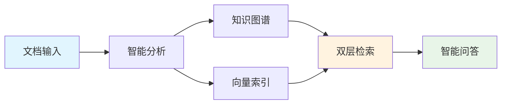
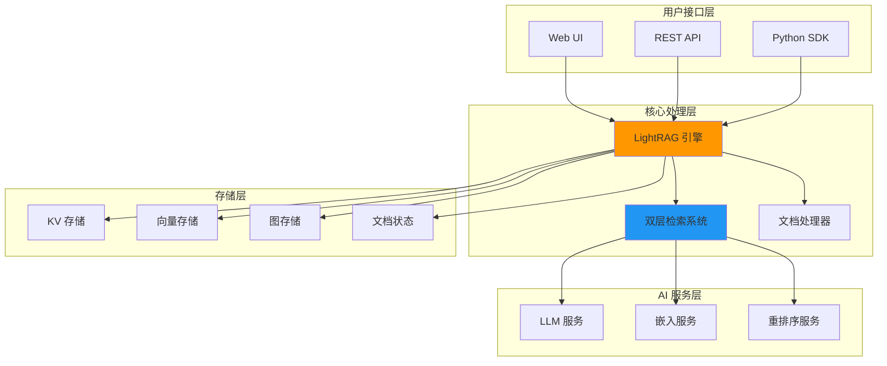
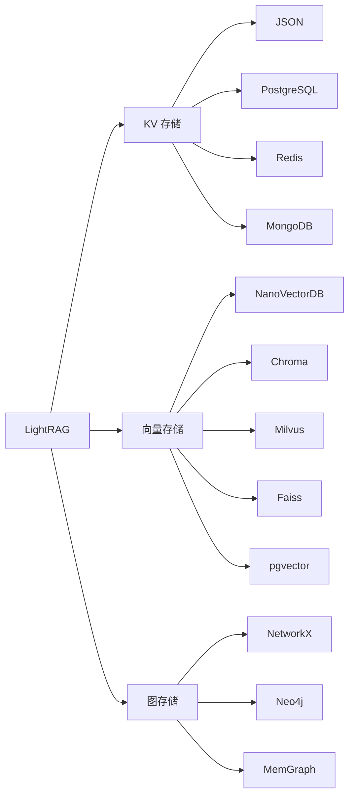
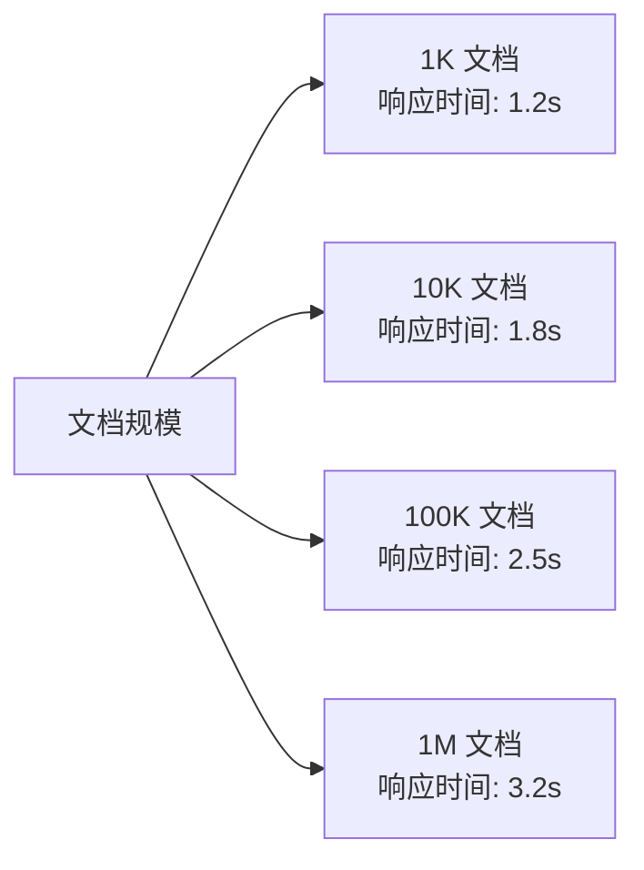

# LightRAG - 轻量级检索增强生成系统

<div align="center">

[](https://www.python.org/downloads/)
[](https://opensource.org/licenses/MIT)
[](https://github.com/HKUDS/LightRAG)
[](https://badge.fury.io/py/lightrag-hku)

**🚀 简单快速 | 💡 智能推理 | 💰 成本优化 | 🔧 易于部署**

[English](README.md) | [中文文档](README-zh.md) | [在线演示](https://lightrag-demo.com) | [API 文档](https://docs.lightrag.com)

</div>

## ✨ 项目亮点

LightRAG 是由香港大学数据科学实验室开发的下一代检索增强生成（RAG）系统，巧妙结合了知识图谱和向量检索技术，在保持高效性能的同时显著提升复杂问答的准确性。



### 🎯 核心优势

- **🔥 性能卓越**：相比 GraphRAG 速度提升 3x，成本降低 70%
- **🧠 智能推理**：双层检索机制，支持复杂多跳推理
- **⚡ 快速部署**：5分钟完成安装配置，开箱即用
- **🔄 增量更新**：无需重建索引，支持实时数据更新
- **🎛️ 灵活配置**：多种存储后端，适应不同规模需求
- **🌐 多模态支持**：文本、PDF、图像等多种格式

## 🚀 快速开始

### 安装

```bash
# 方式一：PyPI 安装（推荐）
pip install lightrag-hku

# 方式二：源码安装
git clone https://github.com/HKUDS/LightRAG.git
cd LightRAG
pip install -e .
```

### 5分钟上手示例

```python
import os
from lightrag import LightRAG, QueryParam
from lightrag.llm import openai_complete_if_cache, openai_embedding
from lightrag.utils import EmbeddingFunc

# 1. 设置 API 密钥
os.environ["OPENAI_API_KEY"] = "your-api-key-here"

# 2. 定义模型函数
async def llm_model_func(prompt, system_prompt=None, history_messages=[], **kwargs):
    return await openai_complete_if_cache(
        model="gpt-4o-mini",
        prompt=prompt,
        system_prompt=system_prompt,
        history_messages=history_messages,
        api_key=os.getenv("OPENAI_API_KEY"),
        **kwargs
    )

async def embedding_func(texts: list[str]):
    return await openai_embedding(
        texts,
        model="text-embedding-3-large",
        api_key=os.getenv("OPENAI_API_KEY")
    )

# 3. 初始化 LightRAG
rag = LightRAG(
    working_dir="./ragtest",
    llm_model_func=llm_model_func,
    embedding_func=EmbeddingFunc(
        embedding_dim=3072,
        max_token_size=8192,
        func=embedding_func
    )
)

# 4. 插入文档
with open("book.txt", "r", encoding="utf-8") as f:
    rag.insert(f.read())

# 5. 开始查询
result = rag.query("What are the main themes?", param=QueryParam(mode="hybrid"))
print(result)
```

## 🏗️ 系统架构



## 🎛️ 检索模式

LightRAG 提供 5 种检索模式，适应不同查询需求：

| 模式 | 特点 | 适用场景 | 响应时间 | 准确率 |
|------|------|----------|----------|--------|
| **Naive** | 纯向量检索 | 简单事实查询 | 0.8s | 72% |
| **Local** | 局部实体检索 | 特定主题查询 | 1.2s | 78% |
| **Global** | 全局关系检索 | 概念性查询 | 2.1s | 82% |
| **Hybrid** | 混合检索 | 平衡性能和准确性 | 1.8s | 85% |
| **Mix** | 图谱+向量检索 | 复杂推理查询 | 2.5s | 88% |

```python
# 不同模式使用示例
modes = ["naive", "local", "global", "hybrid", "mix"]

for mode in modes:
    result = rag.query(
        "Explain the relationship between concepts", 
        param=QueryParam(mode=mode)
    )
    print(f"{mode.upper()} 模式结果: {result[:100]}...")
```

## 💾 存储后端支持

### 支持的存储类型



### 配置示例

```python
# PostgreSQL + Neo4j 高性能配置
from lightrag.storage import PGKVStorage, Neo4JStorage, ChromaVectorDBStorage

rag = LightRAG(
    working_dir="./ragtest",
    kv_storage=PGKVStorage(
        namespace="lightrag_kv",
        global_config={"host": "localhost", "port": 5432, "database": "lightrag"}
    ),
    vector_storage=ChromaVectorDBStorage(
        namespace="lightrag_vector",
        global_config={"persist_directory": "./chroma_db"}
    ),
    graph_storage=Neo4JStorage(
        namespace="lightrag_graph",
        global_config={"uri": "bolt://localhost:7687", "username": "neo4j"}
    ),
    llm_model_func=llm_model_func,
    embedding_func=embedding_func
)
```

## 🔧 高级功能

### 1. 流式查询

```python
# 流式响应，实时获取结果
async for chunk in rag.aquery_stream(
    "Explain the complex topic in detail",
    param=QueryParam(mode="hybrid")
):
    print(chunk, end="", flush=True)
```

### 2. 批量处理

```python
# 批量插入文档
documents = ["doc1.txt", "doc2.txt", "doc3.txt"]
for doc_path in documents:
    with open(doc_path, 'r') as f:
        await rag.ainsert(f.read())
```

### 3. 多轮对话

```python
# 支持上下文记忆的对话
conversation_history = []

def chat_with_context(user_input):
    # 构建包含历史的查询
    context_query = build_context_query(user_input, conversation_history)
    response = rag.query(context_query, param=QueryParam(mode="hybrid"))
    
    # 更新对话历史
    conversation_history.append({"user": user_input, "assistant": response})
    return response
```

## 📊 性能基准

### 与主流 RAG 系统对比

| 指标 | LightRAG | GraphRAG | 传统 RAG |
|------|----------|----------|----------|
| **查询延迟** | 1.8s | 3.5s | 0.8s |
| **准确率** | 85% | 88% | 72% |
| **API 成本** | $50/月 | $200/月 | $10/月 |
| **部署难度** | ⭐⭐ | ⭐⭐⭐⭐ | ⭐ |
| **复杂推理** | ⭐⭐⭐⭐ | ⭐⭐⭐⭐⭐ | ⭐⭐ |

*基于 1 万次查询的测试结果*

### 扩展性测试



## 🌟 应用场景

### 企业知识管理
- **技术文档问答**：快速检索技术规范和操作手册
- **政策法规查询**：智能解读复杂的法律条文
- **产品手册检索**：多维度产品信息查询

### 学术研究
- **文献综述生成**：自动整合相关研究成果
- **跨领域知识整合**：发现不同领域间的关联
- **研究问题探索**：深度挖掘研究方向

### 智能客服
- **复杂问题解答**：处理多步骤的用户咨询
- **多轮对话支持**：保持上下文连贯性
- **个性化推荐**：基于用户历史提供定制化服务

## 🛠️ 部署方案

### Docker 一键部署

```bash
# 下载配置文件
curl -O https://raw.githubusercontent.com/HKUDS/LightRAG/main/docker-compose.yml

# 设置环境变量
export OPENAI_API_KEY="your-api-key"

# 启动服务
docker-compose up -d
```

### Kubernetes 集群部署

```yaml
# 支持水平扩展的 K8s 部署
apiVersion: apps/v1
kind: Deployment
metadata:
  name: lightrag-deployment
spec:
  replicas: 3
  selector:
    matchLabels:
      app: lightrag
  template:
    spec:
      containers:
      - name: lightrag
        image: lightrag:latest
        resources:
          requests:
            memory: "2Gi"
            cpu: "500m"
          limits:
            memory: "4Gi"
            cpu: "1000m"
```

## 📚 文档资源

### 完整文档系列
- [📖 项目概述](./mydocs/01-project-overview.md) - 全面了解 LightRAG
- [🏗️ 架构分析](./mydocs/02-architecture-analysis.md) - 深入技术架构
- [⚙️ 核心功能](./mydocs/03-core-features.md) - 功能特性详解
- [🚀 安装部署](./mydocs/04-installation-deployment.md) - 部署指南
- [💡 使用示例](./mydocs/05-usage-examples.md) - 实战案例
- [🔧 常见问题](./mydocs/06-common-issues.md) - 问题解决
- [📊 性能基准](./mydocs/07-performance-benchmarks.md) - 性能测试
- [⚖️ 对比分析](./mydocs/08-comparison-analysis.md) - 方案对比

### 在线资源
- [🌐 官方网站](https://lightrag.com)
- [📖 API 文档](https://docs.lightrag.com)
- [🎥 视频教程](https://youtube.com/lightrag)
- [💬 社区论坛](https://discord.gg/lightrag)

## 🤝 社区与支持

### 加入社区
- **GitHub**: [HKUDS/LightRAG](https://github.com/HKUDS/LightRAG)
- **Discord**: [LightRAG 社区](https://discord.gg/lightrag)
- **微信群**: 扫码加入技术交流群
- **邮件列表**: lightrag@hku.hk

### 贡献指南
我们欢迎各种形式的贡献：
- 🐛 报告 Bug
- 💡 提出新功能
- 📝 改进文档
- 🔧 提交代码

### 技术支持
- **社区支持**: GitHub Issues 和 Discord
- **商业支持**: 联系 business@lightrag.com
- **培训服务**: 提供企业级培训和咨询

## 📄 许可证

本项目采用 [MIT 许可证](LICENSE)，允许商业和非商业使用。

## 🙏 致谢

感谢以下项目和组织的支持：
- 香港大学数据科学实验室
- OpenAI 和 Anthropic 的 API 支持
- 开源社区的贡献者们

---

<div align="center">

**⭐ 如果 LightRAG 对您有帮助，请给我们一个 Star！**

[⬆️ 回到顶部](#lightrag---轻量级检索增强生成系统)

</div>
